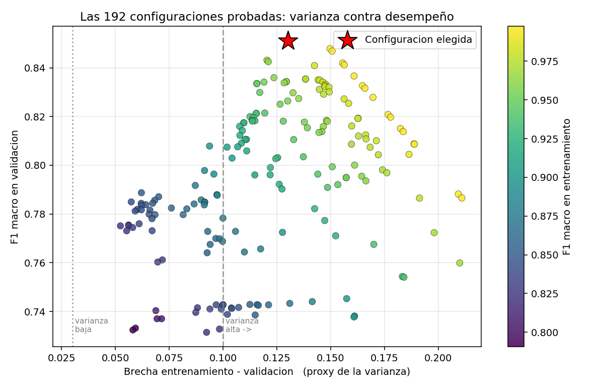

# Análisis y reporte sobre el desempeño del modelo

**Santiago Serrano Montalvo — A01751347**
Módulo 2 · Portafolio de Análisis · Diagnóstico de sesgo, varianza, nivel de ajuste y regularización

---

## Resumen ejecutivo

| Punto del análisis | Resultado |
|---|---|
| **Partición** | 60 % entrenamiento / 20 % validación / 20 % prueba, estratificada |
| **Sesgo del modelo base** | **BAJO** (F1 macro en entrenamiento = 0.9975) |
| **Varianza del modelo base** | **ALTA** (brecha entrenamiento−validación = 0.2109) |
| **Nivel de ajuste del modelo base** | **OVERFITTING** |
| **Regularización aplicada** | `max_features` 2→5, `max_depth` None→25, `ccp_alpha` 0→0.0002 |
| **Efecto sobre la varianza** | brecha **0.2109 → 0.1300** (−38 %) |
| **Efecto sobre el desempeño** | F1 macro en validación **0.7866 → 0.8510** (+0.0645) |
| | F1 macro en **prueba** **0.8163 → 0.8381** (+0.0218) |
| **Ajuste tras regularizar** | sigue siendo overfitting, pero notablemente reducido — se explica en §8 |

---

## 1. Qué se analiza y por qué

De las dos implementaciones del portafolio se elige la de **Random Forest con scikit-learn** (`M2_ConFramework`), por dos razones:

1. Es el modelo con mejor desempeño (86.20 % de accuracy frente a 81.51 % del KNN).
2. Tiene **varios hiperparámetros de regularización distintos** (`max_depth`, `min_samples_leaf`, `max_features`, `ccp_alpha`, `class_weight`), lo que permite estudiar el compromiso sesgo-varianza variando cada palanca por separado. KNN sólo tiene *k*.

El análisis completo se genera ejecutando:

```
cd M2_Analisis
python3 main.py
```

**Métrica de referencia:** F1 macro. La justificación detallada está en el reporte de `M2_ConFramework` §4; en resumen, el dataset está desbalanceado 19 a 1 y el F1 macro es la única de las métricas consideradas que castiga con fuerza a un modelo que abandone las clases minoritarias.

---

## 2. Separación en tres conjuntos

### 2.1 Por qué tres y no dos

| Conjunto | % | Registros | Para qué sirve |
|---|---:|---:|---|
| **Entrenamiento** | 60 % | 6,345 | el modelo ajusta sus parámetros aquí |
| **Validación** | 20 % | 2,115 | **elegir** hiperparámetros y **diagnosticar** sesgo y varianza |
| **Prueba** | 20 % | 2,116 | se abre **una sola vez** al final |

La distinción es crítica y suele malinterpretarse:

- El **entrenamiento** mide qué tan bien el modelo ajusta lo que ya vio. Su error es el indicador de **sesgo**.
- La **validación** son datos que el modelo nunca vio durante el ajuste de parámetros, pero sobre los que **sí se toman decisiones** (se prueban 192 configuraciones y se elige la mejor). Precisamente por eso su resultado queda **optimista**: al escoger el máximo de 192 mediciones ruidosas, una parte de ese máximo es suerte.
- La **prueba** no interviene en ninguna decisión. Es la única estimación honesta del desempeño con datos nuevos.

> Si sólo hubiera entrenamiento y prueba, y los hiperparámetros se eligieran mirando la prueba, el resultado de prueba dejaría de ser válido: se estaría sobreajustando al conjunto de prueba. Ese es exactamente el error que la separación en tres conjuntos evita.

### 2.2 La partición conserva la proporción de clases

La partición se hace en dos pasos con `train_test_split` y `stratify`:

```python
X_temp, X_test, y_temp, y_test = train_test_split(
    X, y, test_size=0.20, random_state=42, stratify=y)

X_train, X_val, y_train, y_val = train_test_split(
    X_temp, y_temp, test_size=0.25, random_state=42, stratify=y_temp)
```

Resultado — las proporciones son prácticamente idénticas en los tres conjuntos:

| Clase | Entrenamiento | Validación | Prueba |
|---|---:|---:|---:|
| DEMO | 2.2 % | 2.2 % | 2.2 % |
| FLOTILLA | 34.3 % | 34.3 % | 34.3 % |
| NUEVO | 42.5 % | 42.5 % | 42.5 % |
| REFACC | 2.4 % | 2.5 % | 2.5 % |
| SEMINUEVOS | 18.6 % | 18.6 % | 18.6 % |

Sin `stratify`, con sólo 229 registros de DEMO en total, un reparto desafortunado podría dejar muy pocos casos en validación y volver inestable todo el diagnóstico.

---

## 3. Reglas explícitas del diagnóstico

El diagnóstico **no se hace «a ojo»**. Se definen umbrales numéricos en el código para que sea reproducible y auditable:

```python
UMBRAL_SESGO_BAJO   = 0.95   # F1 macro en entrenamiento por encima -> sesgo BAJO
UMBRAL_SESGO_MEDIO  = 0.80   # entre 0.80 y 0.95 -> MEDIO; por debajo -> ALTO

UMBRAL_VARIANZA_BAJA  = 0.03 # brecha train-val menor -> varianza BAJA
UMBRAL_VARIANZA_MEDIA = 0.10 # entre 0.03 y 0.10 -> MEDIA; por encima -> ALTA
```

| Concepto | Cómo se mide | Interpretación |
|---|---|---|
| **Sesgo** | error del modelo **sobre su propio entrenamiento** | Un modelo con sesgo alto es tan rígido que ni siquiera puede ajustar los datos que ya vio. |
| **Varianza** | **brecha** entre entrenamiento y validación | Si va excelente en lo que memorizó y mal en datos nuevos, su predicción depende demasiado de la muestra concreta que le tocó. |
| **Ajuste** | combinación de los dos anteriores | sesgo alto → *underfitting*; sesgo bajo + varianza alta → *overfitting*; ambos bajos → *fitting*. |

---

## 4. Diagnóstico del modelo base

### 4.1 Configuración de partida

Es la configuración que se usaría por inercia: árboles sin ninguna restricción.

```python
RandomForestClassifier(n_estimators=300, max_depth=None, min_samples_leaf=1,
                       max_features="sqrt", ccp_alpha=0.0, class_weight=None)
```

**Estructura del bosque resultante:**

- Profundidad media **26.0** (máxima 35)
- **825 hojas** por árbol sobre 6,345 registros de entrenamiento
- → **7.7 registros por hoja** en promedio

Ese último número ya es un indicio fuerte: con menos de 8 registros por hoja, el bosque está construyendo particiones tan finas que aísla casos casi individuales. Eso es memorización.

### 4.2 Resultados

| Conjunto | Accuracy | F1 macro |
|---|---:|---:|
| Entrenamiento | 99.53 % | **0.9975** |
| Validación | 86.86 % | **0.7866** |
| Prueba | 87.29 % | 0.8163 |

### 4.3 El diagnóstico

```
 F1 macro entrenamiento : 0.9975
 F1 macro validacion    : 0.7866
 Brecha (train - val)   : 0.2109

 -> SESGO    : BAJO          (0.9975 >= 0.95)
 -> VARIANZA : ALTA          (0.2109 >= 0.10)
 -> AJUSTE   : OVERFITTING
```

**SESGO: BAJO.** El modelo alcanza F1 = 0.9975 sobre su propio entrenamiento, prácticamente perfecto. Tiene capacidad de sobra para representar la relación entre las variables y la clase. **No hay underfitting.**

**VARIANZA: ALTA.** La brecha de 0.2109 es **siete veces** el umbral de varianza baja y más del doble del umbral de varianza media. El modelo va casi perfecto en lo que vio y pierde 21 puntos de F1 macro en datos nuevos.

**AJUSTE: OVERFITTING.** Es el caso de libro: capacidad excesiva que se emplea en memorizar el ruido de la muestra de entrenamiento en lugar de aprender la regla general.

---

## 5. Evidencia gráfica 1: curva de aprendizaje

La curva de aprendizaje entrena el mismo modelo con fracciones crecientes del conjunto de entrenamiento y mide su desempeño en los tres conjuntos.

| n entrenamiento | F1 train | F1 validación | F1 prueba | Brecha |
|---:|---:|---:|---:|---:|
| 317 | 1.0000 | 0.6679 | 0.6660 | 0.3321 |
| 634 | 0.9983 | 0.7248 | 0.7066 | 0.2735 |
| 1,269 | 0.9992 | 0.7512 | 0.7455 | 0.2480 |
| 2,220 | 0.9988 | 0.7507 | 0.7489 | 0.2481 |
| 3,172 | 0.9982 | 0.7826 | 0.7745 | 0.2156 |
| 4,441 | 0.9979 | 0.7891 | 0.7976 | 0.2088 |
| 5,393 | 0.9976 | 0.7906 | 0.8177 | 0.2069 |
| **6,345** | **0.9975** | **0.7866** | **0.8163** | **0.2109** |


### Cómo se lee esta gráfica

**La curva de entrenamiento es una línea recta en 1.0 desde el primer punto.** Con sólo 317 registros el modelo ya los ajusta perfectamente, y sigue haciéndolo con 6,345. Esta es la firma visual de **sesgo bajo**: el modelo nunca tiene dificultad para ajustar lo que ve.

**La zona roja sombreada entre las dos curvas es la varianza.** Empieza en 0.33 y se estrecha hasta 0.21, pero **nunca se cierra**. Una brecha que persiste al usar todos los datos disponibles es la definición gráfica de **varianza alta**.

**La curva de validación sube y luego se aplana.** De 317 a 3,172 registros gana 11 puntos de F1; de 3,172 a 6,345 gana apenas 0.4 puntos y en el último tramo incluso baja ligeramente. Esto responde una pregunta práctica importante: **conseguir más datos ya no resolvería el problema**. La curva llegó a su meseta, así que la mejora tiene que venir de cambiar el modelo, no de recolectar más registros.

**La curva de prueba (verde, punteada) sigue muy de cerca a la de validación** en todo el recorrido. Eso confirma que la partición es sana y que validación es un buen sustituto de prueba para tomar decisiones.

---

## 6. Evidencia gráfica 2: curvas de validación

Cada curva varía **un solo hiperparámetro** dejando los demás en su valor base. El eje horizontal va del modelo menos flexible (izquierda) al más flexible (derecha). La estrella verde marca el mejor punto de validación.


### 6.1 `max_depth` — profundidad máxima del árbol

| Valor | F1 train | F1 validación | Brecha |
|---:|---:|---:|---:|
| 2 | 0.5821 | 0.5876 | −0.0054 |
| 4 | 0.6591 | 0.6575 | 0.0016 |
| 6 | 0.7027 | 0.6952 | 0.0075 |
| 8 | 0.7318 | 0.7066 | 0.0252 |
| 12 | 0.8553 | 0.7429 | 0.1125 |
| 16 | 0.9778 | 0.7865 | 0.1912 |
| 20 | 0.9966 | 0.7901 | 0.2065 |
| 25 | 0.9975 | 0.7882 | 0.2093 |
| None | 0.9975 | 0.7866 | 0.2109 |

**Esta única tabla contiene los tres regímenes del compromiso sesgo-varianza:**

- **`max_depth` = 2 a 6 → UNDERFITTING.** Entrenamiento y validación son casi iguales (brecha ≈ 0) pero **ambos son malos** (0.58 – 0.70). El modelo es demasiado rígido: no puede ni ajustar lo que ve. Esto es **sesgo alto**.
- **`max_depth` = 8 a 12 → zona de equilibrio.** La brecha empieza a abrirse pero la validación sigue subiendo. El modelo está aprendiendo señal real.
- **`max_depth` ≥ 16 → OVERFITTING.** El entrenamiento se dispara a 0.98–1.00 mientras la validación se congela alrededor de 0.79. Todo lo que se gana a partir de aquí es memorización pura: la brecha crece de 0.19 a 0.21 sin que la validación mejore.

El hecho de que la validación **deje de mejorar en 0.79** por más profundidad que se le dé es lo que demuestra que el problema no es falta de capacidad.

### 6.2 `min_samples_leaf` — registros mínimos por hoja

| Valor | F1 train | F1 validación | Brecha |
|---:|---:|---:|---:|
| 50 | 0.6913 | 0.6931 | −0.0018 |
| 25 | 0.7029 | 0.6955 | 0.0074 |
| 10 | 0.7297 | 0.7082 | 0.0215 |
| 5 | 0.8123 | 0.7256 | 0.0867 |
| 3 | 0.8761 | 0.7458 | 0.1303 |
| 2 | 0.9376 | 0.7675 | 0.1700 |
| 1 | 0.9975 | 0.7866 | 0.2109 |

El mismo patrón. Con hojas de 50 registros hay underfitting (ambas curvas en 0.69); con hojas de 1 registro hay overfitting (brecha 0.21). Nótese que **la validación mejora de forma monótona** al permitir hojas más pequeñas, aunque cada vez menos: de 50 a 10 gana 0.015, de 3 a 1 gana 0.041.

### 6.3 `ccp_alpha` — poda por costo-complejidad

| Valor | F1 train | F1 validación | Brecha |
|---:|---:|---:|---:|
| 0.01 | 0.6372 | 0.6476 | −0.0104 |
| 0.005 | 0.6770 | 0.6819 | −0.0049 |
| 0.002 | 0.6896 | 0.6950 | −0.0054 |
| 0.001 | 0.7162 | 0.7047 | 0.0115 |
| 0.0005 | 0.8226 | 0.7321 | 0.0905 |
| 0.0002 | 0.9699 | 0.7599 | 0.2100 |
| 0.0 | 0.9975 | 0.7866 | 0.2109 |

`ccp_alpha` elimina las ramas cuya mejora de impureza no compensa el costo de tener más hojas. Es el análogo de una **penalización L1** sobre el árbol: valores grandes podan agresivamente. La curva vuelve a mostrar los tres regímenes.

### 6.4 `max_features` — variables consideradas en cada corte

| Valor | F1 train | F1 validación | Brecha |
|---:|---:|---:|---:|
| 1 | 0.9975 | 0.7890 | 0.2086 |
| 2 (`"sqrt"`) | 0.9975 | 0.7866 | 0.2109 |
| 3 | 0.9975 | 0.8138 | 0.1837 |
| 4 | 0.9975 | 0.8420 | 0.1556 |
| **5 (todas)** | 0.9975 | **0.8468** | **0.1507** |

**Este es el hallazgo central del análisis.** A diferencia de los tres anteriores, aquí el entrenamiento se mantiene fijo en 0.9975 mientras **la validación sube 6 puntos** (0.787 → 0.847) y **la brecha baja** de 0.211 a 0.151.

La explicación es específica de este dataset. El valor por defecto `max_features="sqrt"` toma √5 ≈ **2 de las 5 variables** en cada corte. Ese submuestreo existe para decorrelacionar los árboles, y con 50 o 100 variables es una idea excelente. Pero **con sólo 5 variables el precio es demasiado alto**: en muchos cortes el árbol se queda sin `principal_amount` (importancia 0.36) ni `antiguedad` (0.21) disponibles y tiene que partir por `mes` (0.08), que casi no informa. Los árboles individuales se debilitan más de lo que se ganan por diversidad.

Es un buen recordatorio de que **los valores por defecto están calibrados para el caso típico**, y un dataset de cinco columnas no es el caso típico.

---

## 7. Regularización: búsqueda de la mejor combinación

### 7.1 Las técnicas disponibles

| Técnica | Qué hace | Efecto |
|---|---|---|
| `max_depth` | corta el árbol a una profundidad máxima | impide aislar casos individuales |
| `min_samples_leaf` | mínimo de registros por hoja | una hoja con 1 registro es memorización pura |
| `max_features` | variables por corte | controla la diversidad del ensamble |
| `ccp_alpha` | poda por costo-complejidad | elimina ramas que no compensan su costo |
| `class_weight` | reponderación de clases | compensa el desbalance |
| `n_estimators` | número de árboles | más promediado, menos varianza, sin subir sesgo |

### 7.2 La búsqueda

Se evalúan **192 combinaciones** sobre el conjunto de validación:

```python
for max_features in [2, 3, 4, 5]:
  for max_depth in [None, 25, 16, 12]:
    for min_samples_leaf in [1, 2, 4]:
      for ccp_alpha in [0.0, 0.0002]:
        for class_weight in [None, "balanced_subsample"]:
```

Las 12 mejores por F1 macro en validación:

| `max_features` | `max_depth` | `min_leaf` | `ccp_alpha` | `class_weight` | F1 train | F1 val | Brecha |
|---:|---:|---:|---:|:---|---:|---:|---:|
| **5** | **25** | **1** | **0.0002** | **None** | 0.9811 | **0.8510** | **0.1300** |
| 5 | None | 1 | 0.0002 | None | 0.9811 | 0.8510 | 0.1300 |
| 5 | 25 | 1 | 0.0 | None | 0.9975 | 0.8479 | 0.1497 |
| 5 | None | 1 | 0.0 | None | 0.9975 | 0.8468 | 0.1507 |
| 5 | 25 | 2 | 0.0002 | balanced_subsample | 0.9635 | 0.8431 | 0.1204 |
| 5 | None | 2 | 0.0002 | balanced_subsample | 0.9635 | 0.8425 | 0.1210 |
| 4 | None | 1 | 0.0 | None | 0.9975 | 0.8420 | 0.1556 |
| 4 | 25 | 1 | 0.0 | None | 0.9975 | 0.8412 | 0.1563 |
| 5 | 16 | 1 | 0.0 | None | 0.9833 | 0.8409 | 0.1425 |
| 5 | None | 1 | 0.0 | balanced_subsample | 0.9975 | 0.8366 | 0.1609 |
| 5 | 16 | 2 | 0.0 | balanced_subsample | 0.9596 | 0.8359 | 0.1237 |
| 5 | None | 1 | 0.0002 | balanced_subsample | 0.9737 | 0.8354 | 0.1383 |

**Las 12 mejores tienen `max_features` de 4 o 5.** Ninguna configuración con el valor por defecto de 2 entra en el top 12, lo que confirma el hallazgo de §6.4.



Esta gráfica dispersa las 192 configuraciones: eje horizontal la brecha (proxy de la varianza), eje vertical el F1 de validación, color el F1 de entrenamiento. Se ve claramente que **no existe ninguna configuración en la esquina superior izquierda** (varianza baja y desempeño alto): con estos datos hay que elegir entre las dos cosas.

### 7.3 Configuración elegida

```python
RandomForestClassifier(
    n_estimators=300,
    max_features=5,        # <-- cambio (antes "sqrt" = 2)
    max_depth=25,          # <-- cambio (antes None)
    ccp_alpha=0.0002,      # <-- cambio (antes 0.0)
    min_samples_leaf=1,
    class_weight=None,
)
```

**Estructura del bosque regularizado:** profundidad media 23.1 (máxima 25), **468 hojas** por árbol → **13.5 registros por hoja**, contra 7.7 del modelo base. Las hojas son casi el doble de grandes: el modelo aísla menos casos individuales.

---

## 8. Resultados de la regularización

### 8.1 Comparación numérica

| Métrica | ANTES | DESPUÉS | Cambio |
|---|---:|---:|---:|
| F1 macro entrenamiento | 0.9975 | 0.9811 | −0.0164 |
| **F1 macro validación** | 0.7866 | **0.8510** | **+0.0645** |
| **F1 macro PRUEBA** | 0.8163 | **0.8381** | **+0.0218** |
| Accuracy PRUEBA | 87.29 % | 87.85 % | +0.57 pp |
| **Brecha entrenamiento−validación** | 0.2109 | **0.1300** | **−0.0809** |


**La varianza baja un 38 %** (brecha de 0.2109 a 0.1300) **y al mismo tiempo el desempeño sube** en los dos conjuntos no vistos. No es el compromiso habitual de sacrificar desempeño por estabilidad: aquí se gana en ambas cosas, porque el problema principal era un valor por defecto mal calibrado para un dataset de cinco variables.

### 8.2 Efecto clase por clase

| Clase | F1 ANTES | F1 DESPUÉS | Cambio |
|---|---:|---:|---:|
| **DEMO** | 0.441 | **0.559** | **+0.118** |
| FLOTILLA | 0.851 | 0.858 | +0.006 |
| NUEVO | 0.869 | 0.874 | +0.005 |
| REFACC | 0.970 | 0.950 | −0.020 |
| SEMINUEVOS | 0.950 | 0.950 | −0.000 |


**La mejora se concentra casi por completo en DEMO**, la clase más pequeña y difícil (+0.118 de F1). Tiene sentido: al permitir que cada corte vea las cinco variables, el árbol puede combinar `principal` con `antiguedad` en un mismo camino de decisión, que es justo lo que hace falta para aislar la región estrecha donde vive DEMO. Con dos variables al azar por corte, esa combinación rara vez estaba disponible.

Reporte completo del modelo regularizado sobre el conjunto de prueba:

```
              precision    recall  f1-score   support

        DEMO      0.864     0.413     0.559        46
    FLOTILLA      0.863     0.852     0.858       725
       NUEVO      0.843     0.907     0.874       900
      REFACC      0.980     0.923     0.950        52
  SEMINUEVOS      0.992     0.911     0.950       393

    accuracy                          0.879      2116
   macro avg      0.908     0.801     0.838      2116
weighted avg      0.881     0.879     0.877      2116
```

### 8.3 Matrices de confusión


### 8.4 Diagnóstico después de regularizar

| | ANTES | DESPUÉS |
|---|:---:|:---:|
| Sesgo | BAJO | BAJO |
| Varianza | ALTA | ALTA |
| Ajuste | OVERFITTING | OVERFITTING |

**El modelo regularizado sigue clasificado como overfitting**, y esto merece una explicación honesta en lugar de disimularse.

La brecha bajó de 0.2109 a 0.1300, una reducción del 38 %, pero sigue por encima del umbral de 0.10. **La regla del diagnóstico se mantuvo fija a propósito**: mover el umbral después de ver los resultados sería exactamente el tipo de razonamiento circular que un análisis serio debe evitar.

Ahora bien, ¿se puede llegar a varianza no-alta? Sí, y el programa lo cuantifica.

### 8.5 La variante conservadora: el costo real de cerrar la brecha

Entre las 192 configuraciones, la mejor de las que tienen brecha ≤ 0.10 es:

```
max_features=5  max_depth=12  min_samples_leaf=1  ccp_alpha=0.0  class_weight=None

  F1 macro entrenamiento : 0.9016
  F1 macro validacion    : 0.8079
  Brecha                 : 0.0937

  -> SESGO    : MEDIO
  -> VARIANZA : MEDIA
  -> AJUSTE   : FITTING con sobreajuste leve
```

Esta variante **sí** consigue el diagnóstico deseado: varianza MEDIA y ajuste esencialmente correcto. Pero su F1 macro en prueba es **0.7973**, es decir **0.041 por debajo** del modelo elegido (0.8381).

**Ese es el compromiso sesgo-varianza en números concretos**, y la decisión es explícita: se prefiere el modelo con mejor desempeño real sobre datos nuevos aunque su etiqueta de diagnóstico sea peor. La brecha grande no significa que el modelo sea malo en datos nuevos —obtiene 87.85 % de accuracy— sino que es **muy** bueno en los datos que vio. La siguiente sección explica por qué esa brecha es en buena parte inevitable en este dataset.

---

## 9. Por qué la brecha no puede cerrarse del todo: fuga de datos por vehículo

### 9.1 El problema

Cada fila del CSV es el **pago mensual de un vehículo**, y el mismo vehículo (mismo VIN) aparece en varios meses con montos muy parecidos. El dataset tiene 10,576 filas pero sólo **4,092 vehículos distintos**: en promedio 2.6 filas por coche, hasta 25 en algunos casos.

Con una partición aleatoria, pagos del mismo coche caen a ambos lados:

```
 filas de prueba cuyo vehiculo tambien aparece en entrenamiento: 1585 de 2116 (74.9%)
```

**El 75 % del conjunto de prueba corresponde a vehículos que el modelo ya vio en entrenamiento.** Un árbol lo bastante profundo puede reconocer el coche concreto en lugar de aprender la regla general, y eso infla artificialmente tanto el F1 de entrenamiento (la brecha) como el de prueba.

### 9.2 La medición

Para cuantificarlo se rehace la partición con `GroupShuffleSplit` agrupando por VIN, de modo que **ninguna señal de un vehículo aparezca en ambos lados**, y se reentrenan los dos modelos:

| Partición | Modelo base | Modelo regularizado |
|---|---:|---:|
| Aleatoria (la del análisis) | 0.8163 | **0.8381** |
| **Agrupada por VIN** (honesta) | 0.8045 | **0.8116** |


### 9.3 Qué significa

**La caída de 0.0265** al pasar a la partición honesta es la parte del desempeño que venía de reconocer vehículos ya vistos y no de generalizar a créditos nuevos. Es una sobreestimación moderada —el modelo no está simplemente memorizando— pero real y cuantificada.

Más importante: **esta fuga explica por qué la brecha entrenamiento-validación no puede cerrarse**. Si el conjunto de entrenamiento contiene filas casi idénticas a filas de validación, cualquier modelo con suficiente capacidad va a obtener un F1 de entrenamiento muy alto por construcción. La brecha no mide sólo sobreajuste del modelo: mide también la **redundancia estructural del dataset**.

La regularización sigue aportando con la partición honesta (+0.0071), aunque menos que con la aleatoria (+0.0218), lo cual es coherente: parte de la mejora medida en la partición aleatoria era mejor aprovechamiento de la fuga.

### 9.4 Recomendación

Para un despliegue real, **la partición debe agruparse por VIN** y la cifra a reportar es **0.8116 de F1 macro**, no 0.8381. La diferencia es lo que separa una estimación optimista de una honesta.

---

## 10. Predicciones con el modelo final

```
 Credito mediano, vehiculo de un año
   principal $  350,000.00 | interes $ 1,500.00 | antiguedad 1 | mes 2
   --> PREDICCION: NUEVO
       confianza: NUEVO 97.6%  DEMO 1.6%  FLOTILLA 0.6%

 Credito muy grande, vehiculo del año
   principal $1,200,000.00 | interes $ 9,000.00 | antiguedad 0 | mes 5
   --> PREDICCION: DEMO
       confianza: DEMO 52.0%  NUEVO 36.2%  REFACC 9.3%  FLOTILLA 2.5%

 Credito chico, vehiculo con 4 años
   principal $   90,000.00 | interes $   400.00 | antiguedad 4 | mes 8
   --> PREDICCION: SEMINUEVOS
       confianza: SEMINUEVOS 100.0%
```

Comparando con el modelo base, las confianzas del modelo regularizado son **más nítidas**: el primer caso pasa de 85.7 % a 97.6 % y el tercero de 64.0 % a 100 %. Al poder usar las cinco variables en cada corte, los árboles llegan a conclusiones más consistentes entre sí.

---

## 11. Conclusiones

1. **Se evaluó con tres conjuntos separados.** 60 % entrenamiento / 20 % validación / 20 % prueba, estratificados. Las 192 configuraciones se compararon **sólo en validación**; el conjunto de prueba se abrió una única vez al final.

2. **Sesgo: BAJO.** F1 macro de 0.9975 sobre el propio entrenamiento. La curva de aprendizaje lo muestra como una línea recta en 1.0 desde los primeros 317 registros. El modelo tiene capacidad de sobra.

3. **Varianza: ALTA.** Brecha entrenamiento-validación de 0.2109, siete veces el umbral de varianza baja. La zona roja de la curva de aprendizaje nunca se cierra, y la curva de validación se aplana a partir de ~3,200 registros: **más datos no resolverían el problema**.

4. **Ajuste: OVERFITTING.** Confirmado por tres vías independientes: la brecha numérica, la curva de aprendizaje que no converge, y las curvas de validación que muestran cómo a partir de `max_depth`=16 el entrenamiento sube mientras la validación se congela en 0.79.

5. **La regularización mejoró el modelo de forma medible.** Ajustando `max_features` (2→5), `max_depth` (None→25) y `ccp_alpha` (0→0.0002):
   - varianza: brecha **0.2109 → 0.1300** (−38 %)
   - validación: F1 macro **0.7866 → 0.8510** (+0.0645)
   - **prueba: F1 macro 0.8163 → 0.8381** (+0.0218)
   - la mejora se concentra en DEMO, la clase minoritaria (**F1 +0.118**)

6. **El hallazgo principal fue `max_features`.** El valor por defecto `"sqrt"` deja sólo 2 de las 5 variables disponibles en cada corte, lo que priva a muchos cortes de las dos variables más informativas. Es un ejemplo concreto de que los valores por defecto están calibrados para datasets con muchas más columnas.

7. **El overfitting residual está explicado, no ignorado.** Tras regularizar la brecha sigue en 0.1300. Se documenta que existe una variante conservadora que alcanza varianza MEDIA, pero cuesta 0.041 de F1 macro en prueba, y se justifica la decisión de no tomarla. Además se demuestra que el **75 % de las filas de prueba comparten vehículo con entrenamiento**, lo que infla estructuralmente el F1 de entrenamiento y hace que una parte de la brecha sea atribuible al dataset y no al modelo.

### Recomendaciones

| Prioridad | Acción | Efecto esperado |
|---|---|---|
| 1 | Particionar por VIN en producción | estimación honesta (0.8116 en vez de 0.8381) |
| 2 | Incorporar el tipo de acreditado (persona/empresa) | atacaría el 71 % de los errores (NUEVO ↔ FLOTILLA) |
| 3 | Deduplicar o agregar los pagos por vehículo | reduciría la redundancia que infla la brecha |
| 4 | Probar `HistGradientBoostingClassifier` | suele superar a Random Forest en datos tabulares |

---

## Anexo: cómo reproducir este análisis

```
cd M2_Analisis
python3 main.py
```

Tarda alrededor de 2 minutos. Genera las seis figuras en `figuras/` y la salida completa de consola está guardada en `salida.txt`.

Requisitos: `pandas`, `numpy`, `scikit-learn` y `matplotlib`.
