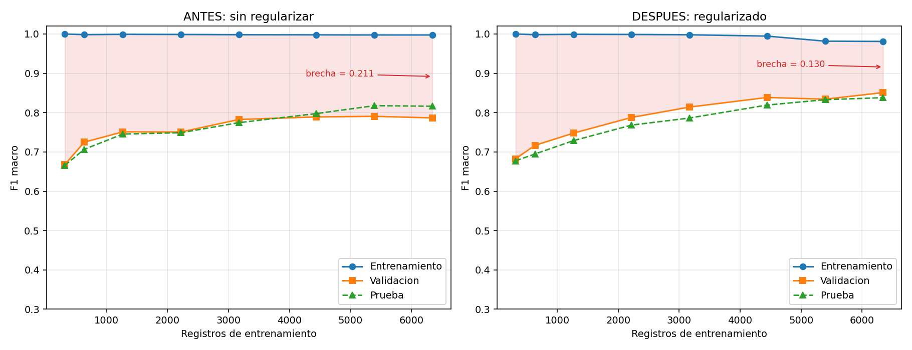
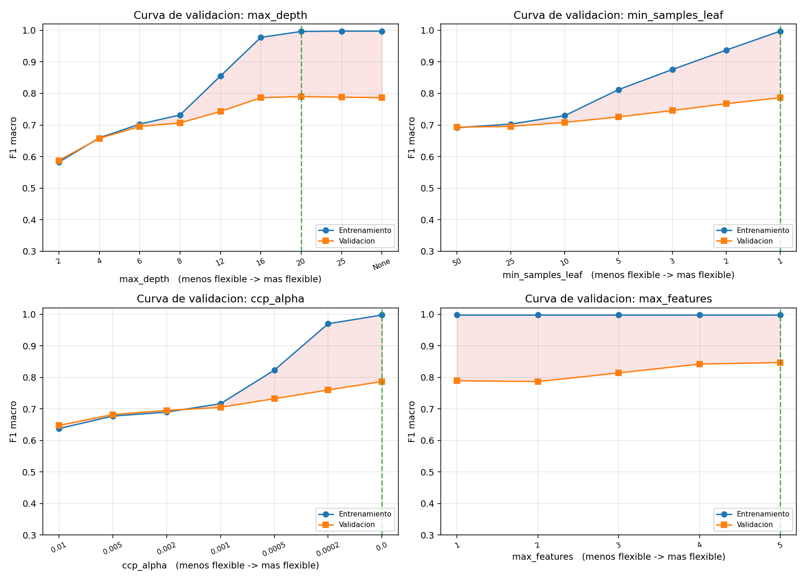
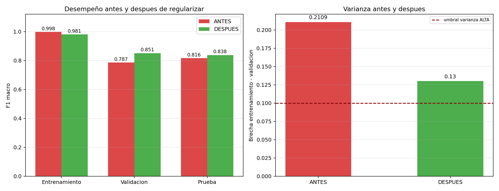
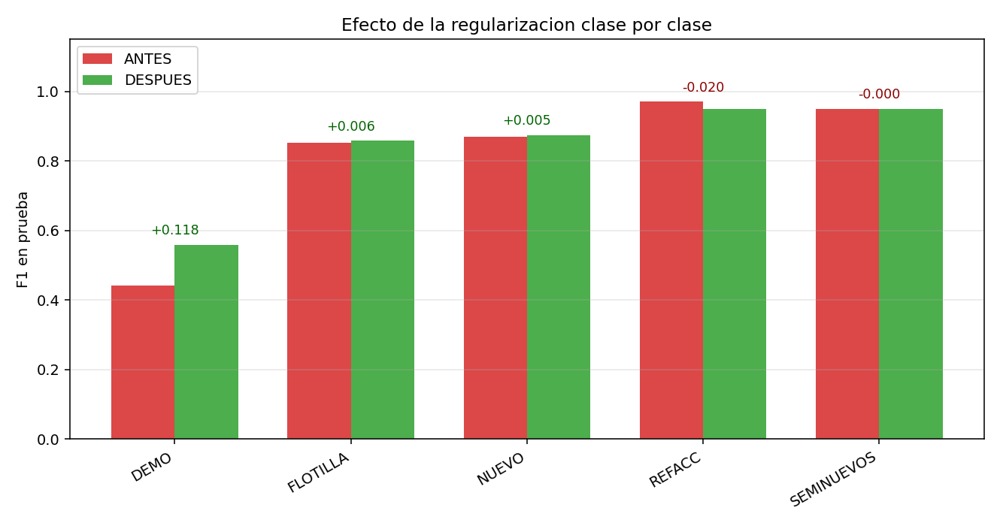
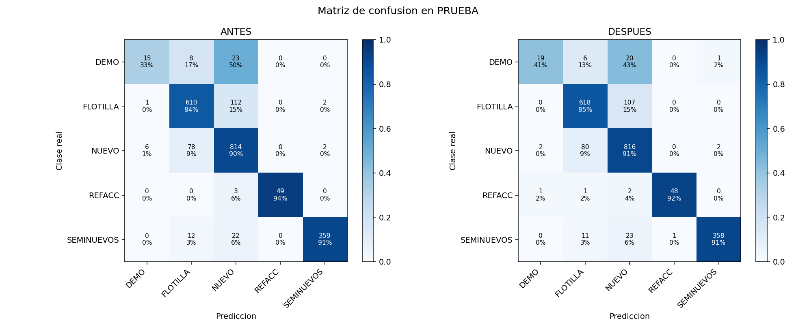
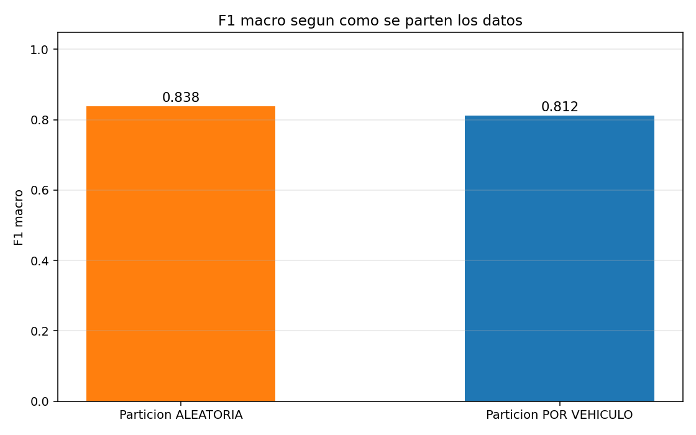

# Análisis del desempeño del modelo

**Santiago Serrano Montalvo · A01751347**
Módulo 2 · Portafolio de Análisis

---

## 1. Qué se analiza

De las dos implementaciones del portafolio se escogió el **Random Forest con scikit-learn**, por dos razones: es el que mejor resultado da (86.20 % contra 81.51 % del KNN) y tiene varios hiperparámetros de regularización distintos, lo que permite estudiar el compromiso entre sesgo y varianza moviendo una palanca a la vez. KNN solo tiene k.

La métrica de referencia es el F1 macro, por la misma razón que en la entrega anterior: el dataset está desbalanceado 19 a 1 y es la única métrica que castiga con fuerza a un modelo que abandone las clases chicas.

Se ejecuta con `python3 main.py` y tarda alrededor de un minuto.

## 2. Separación en tres conjuntos

| Conjunto | % | Registros | Para qué sirve |
|---|---:|---:|---|
| Entrenamiento | 60 % | 6,345 | el modelo ajusta sus parámetros aquí |
| Validación | 20 % | 2,115 | elegir hiperparámetros y diagnosticar sesgo y varianza |
| Prueba | 20 % | 2,116 | se abre una sola vez al final |

La diferencia entre validación y prueba es importante. Sobre validación **sí se toman decisiones**: se prueban 18 configuraciones y se escoge la mejor. Por eso su resultado queda optimista, porque al elegir el máximo de 18 mediciones con ruido una parte de ese máximo es suerte. Prueba no interviene en ninguna decisión, así que es la única estimación honesta del desempeño con datos nuevos.

Si solo hubiera entrenamiento y prueba, y los hiperparámetros se eligieran mirando prueba, el resultado de prueba dejaría de ser válido: se estaría sobreajustando al conjunto de prueba.

La partición se hace en dos pasos porque `train_test_split` solo parte en dos: primero se aparta el 20 % de prueba y después el 20 % de validación de lo que queda. Con `stratify` las proporciones quedan iguales en los tres:

| Clase | Entrenamiento | Validación | Prueba |
|---|---:|---:|---:|
| DEMO | 2.2 % | 2.2 % | 2.2 % |
| FLOTILLA | 34.3 % | 34.3 % | 34.3 % |
| NUEVO | 42.5 % | 42.5 % | 42.5 % |
| REFACC | 2.4 % | 2.5 % | 2.5 % |
| SEMINUEVOS | 18.6 % | 18.6 % | 18.6 % |

Sin `stratify`, con solo 229 registros de DEMO en total, un reparto desafortunado podría dejar muy pocos casos en validación y volver inestable todo el diagnóstico.

## 3. Reglas del diagnóstico

Para que el diagnóstico no sea a ojo, los umbrales están fijos en el código:

```python
SESGO_BAJO    = 0.95   # F1 macro en entrenamiento por encima -> sesgo BAJO
SESGO_MEDIO   = 0.80   # entre 0.80 y 0.95 -> MEDIO; abajo -> ALTO
VARIANZA_BAJA = 0.03   # brecha train-val menor -> varianza BAJA
VARIANZA_MEDIA = 0.10  # entre 0.03 y 0.10 -> MEDIA; arriba -> ALTA
```

El **sesgo** se mide con el error del modelo sobre su propio entrenamiento: un modelo con sesgo alto es tan rígido que ni siquiera ajusta lo que ya vio. La **varianza** se mide con la brecha entre entrenamiento y validación: si va excelente en lo que memorizó y mal en datos nuevos, su predicción depende demasiado de la muestra que le tocó. El **ajuste** sale de combinar los dos: sesgo alto es underfitting, sesgo bajo con varianza alta es overfitting, y los dos bajos es un buen ajuste.

## 4. Diagnóstico del modelo base

La configuración de partida es la que se usaría por inercia, con árboles sin ninguna restricción:

```python
RandomForestClassifier(n_estimators=300, max_depth=None,
                       min_samples_leaf=1, max_features="sqrt", ccp_alpha=0.0)
```

El bosque resultante tiene profundidad media de 26.0 y 825 hojas por árbol sobre 6,345 registros, lo que da **7.7 registros por hoja**. Ese número ya dice algo: con menos de 8 registros por hoja el bosque está aislando casos casi individuales, o sea memorizando.

| Conjunto | Accuracy | F1 macro |
|---|---:|---:|
| Entrenamiento | 99.53 % | 0.9975 |
| Validación | 86.86 % | 0.7866 |
| Prueba | 87.29 % | 0.8163 |

```
 F1 macro entrenamiento: 0.9975
 F1 macro validacion   : 0.7866
 Brecha                : 0.2109

 -> SESGO   : BAJO
 -> VARIANZA: ALTA
 -> AJUSTE  : OVERFITTING
```

**Sesgo bajo.** El modelo llega a 0.9975 sobre su propio entrenamiento, casi perfecto. Tiene capacidad de sobra para representar la relación entre las variables y la clase, así que no hay underfitting.

**Varianza alta.** La brecha de 0.2109 es siete veces el umbral de varianza baja y más del doble del de varianza media. El modelo va casi perfecto en lo que vio y pierde 21 puntos de F1 macro en datos nuevos.

**Overfitting.** Es el caso típico: capacidad de sobra que se usa en memorizar el ruido del entrenamiento en lugar de aprender la regla.

## 5. Curva de aprendizaje

La curva de aprendizaje entrena el mismo modelo con cada vez más datos y mide en los tres conjuntos.

| n entrenamiento | F1 train | F1 validación | F1 prueba | Brecha |
|---:|---:|---:|---:|---:|
| 317 | 1.0000 | 0.6679 | 0.6660 | 0.3321 |
| 634 | 0.9983 | 0.7248 | 0.7066 | 0.2735 |
| 1,269 | 0.9992 | 0.7512 | 0.7455 | 0.2480 |
| 2,220 | 0.9988 | 0.7507 | 0.7489 | 0.2481 |
| 3,172 | 0.9982 | 0.7826 | 0.7745 | 0.2156 |
| 4,441 | 0.9979 | 0.7891 | 0.7976 | 0.2088 |
| 5,393 | 0.9976 | 0.7906 | 0.8177 | 0.2069 |
| 6,345 | 0.9975 | 0.7866 | 0.8163 | 0.2109 |



La curva de entrenamiento es una línea recta en 1.0 desde el primer punto: con solo 317 registros el modelo ya los ajusta perfecto, y sigue igual con 6,345. Esa es la forma visual del sesgo bajo.

La zona roja entre las dos curvas es la varianza. Empieza en 0.33 y se estrecha hasta 0.21, pero nunca se cierra. Una brecha que sigue ahí usando todos los datos disponibles es varianza alta.

La curva de validación sube y luego se aplana: de 317 a 3,172 registros gana 11 puntos de F1, y de ahí a 6,345 gana apenas 0.4 puntos. Eso responde una pregunta práctica: **conseguir más datos ya no resolvería el problema**, la mejora tiene que venir de cambiar el modelo.

La curva de prueba sigue muy de cerca a la de validación en todo el recorrido, lo que indica que la partición está sana y que validación sirve para tomar decisiones.

## 6. Efecto de cada hiperparámetro

Cada curva mueve un solo hiperparámetro dejando los demás en su valor base. El eje horizontal va del modelo menos flexible al más flexible.



### `max_depth`

| Valor | F1 train | F1 validación | Brecha |
|---:|---:|---:|---:|
| 2 | 0.5821 | 0.5876 | −0.0054 |
| 4 | 0.6591 | 0.6575 | 0.0016 |
| 6 | 0.7027 | 0.6952 | 0.0075 |
| 8 | 0.7318 | 0.7066 | 0.0252 |
| 12 | 0.8553 | 0.7429 | 0.1125 |
| 16 | 0.9778 | 0.7865 | 0.1912 |
| 20 | 0.9966 | 0.7901 | 0.2065 |
| 25 | 0.9975 | 0.7882 | 0.2093 |
| None | 0.9975 | 0.7866 | 0.2109 |

Esta sola tabla tiene los tres casos del compromiso sesgo-varianza. Entre 2 y 6 hay **underfitting**: entrenamiento y validación son casi iguales, con brecha cercana a cero, pero los dos son malos (0.58 a 0.70), o sea sesgo alto. Entre 8 y 12 está la zona de equilibrio, donde la brecha empieza a abrirse pero la validación sigue subiendo. De 16 en adelante hay **overfitting**: el entrenamiento se dispara a 0.98–1.00 mientras la validación se congela alrededor de 0.79, así que todo lo que se gana a partir de ahí es memorización.

Que la validación deje de mejorar en 0.79 por más profundidad que se le dé es lo que confirma que el problema no es falta de capacidad.

### `min_samples_leaf`

| Valor | F1 train | F1 validación | Brecha |
|---:|---:|---:|---:|
| 50 | 0.6913 | 0.6931 | −0.0018 |
| 25 | 0.7029 | 0.6955 | 0.0074 |
| 10 | 0.7297 | 0.7082 | 0.0215 |
| 5 | 0.8123 | 0.7256 | 0.0867 |
| 3 | 0.8761 | 0.7458 | 0.1303 |
| 2 | 0.9376 | 0.7675 | 0.1700 |
| 1 | 0.9975 | 0.7866 | 0.2109 |

El mismo patrón. Con hojas de 50 registros hay underfitting (las dos curvas en 0.69) y con hojas de 1 hay overfitting (brecha de 0.21).

### `ccp_alpha`

| Valor | F1 train | F1 validación | Brecha |
|---:|---:|---:|---:|
| 0.01 | 0.6372 | 0.6476 | −0.0104 |
| 0.005 | 0.6770 | 0.6819 | −0.0049 |
| 0.002 | 0.6896 | 0.6950 | −0.0054 |
| 0.001 | 0.7162 | 0.7047 | 0.0115 |
| 0.0005 | 0.8226 | 0.7321 | 0.0905 |
| 0.0002 | 0.9699 | 0.7599 | 0.2100 |
| 0.0 | 0.9975 | 0.7866 | 0.2109 |

`ccp_alpha` poda las ramas cuya mejora de impureza no compensa tener más hojas. Valores grandes podan más agresivamente y la curva vuelve a mostrar los tres casos.

### `max_features`

| Valor | F1 train | F1 validación | Brecha |
|---:|---:|---:|---:|
| 1 | 0.9975 | 0.7890 | 0.2086 |
| 2 (`"sqrt"`) | 0.9975 | 0.7866 | 0.2109 |
| 3 | 0.9975 | 0.8138 | 0.1837 |
| 4 | 0.9975 | 0.8420 | 0.1556 |
| **5 (todas)** | 0.9975 | **0.8468** | **0.1507** |

Este resultado es el hallazgo principal del análisis. A diferencia de los tres anteriores, aquí el entrenamiento se queda fijo en 0.9975 mientras la validación sube 6 puntos (de 0.787 a 0.847) y la brecha baja de 0.211 a 0.151.

La explicación es específica de este dataset. El valor por defecto `max_features="sqrt"` toma √5 ≈ 2 de las 5 variables en cada corte. Ese submuestreo existe para que los árboles no se parezcan entre sí, y con 50 o 100 variables es buena idea. Pero **con solo 5 variables el precio es demasiado alto**: en muchos cortes el árbol se queda sin `principal_amount` (importancia 0.36) ni `antiguedad` (0.21) disponibles y tiene que partir por `mes` (0.08), que casi no informa. Los árboles individuales se debilitan más de lo que se gana por diversidad.

Es un buen recordatorio de que los valores por defecto están pensados para el caso típico, y un dataset de cinco columnas no es el caso típico.

## 7. Regularización

Las técnicas disponibles en un Random Forest son `max_depth` (cortar la profundidad), `min_samples_leaf` (obligar hojas más grandes), `max_features` (cuántas columnas ve cada corte) y `ccp_alpha` (podar ramas que no compensan).

Se probaron 18 combinaciones sobre el conjunto de validación, cruzando `max_features` (2, 3, 5), `max_depth` (None, 25, 12) y `ccp_alpha` (0.0, 0.0002). Las mejores:

| `max_features` | `max_depth` | `ccp_alpha` | F1 train | F1 val | Brecha |
|---:|---:|---:|---:|---:|---:|
| **5** | **25** | **0.0002** | 0.9811 | **0.8510** | **0.1300** |
| 5 | None | 0.0002 | 0.9811 | 0.8510 | 0.1300 |
| 5 | 25 | 0.0 | 0.9975 | 0.8479 | 0.1497 |
| 5 | None | 0.0 | 0.9975 | 0.8468 | 0.1507 |
| 3 | 25 | 0.0 | 0.9975 | 0.8151 | 0.1824 |
| 3 | None | 0.0 | 0.9975 | 0.8138 | 0.1837 |
| 5 | 12 | 0.0 | 0.9016 | 0.8079 | 0.0937 |
| 2 | None | 0.0 | 0.9975 | 0.7866 | 0.2109 |

Las mejores configuraciones son todas de `max_features=5`, lo que confirma el hallazgo de la sección anterior. La configuración elegida es `max_features=5`, `max_depth=25`, `ccp_alpha=0.0002`.

El bosque regularizado tiene 468 hojas por árbol, o sea **13.5 registros por hoja** contra los 7.7 del modelo base: las hojas son casi el doble de grandes y el modelo aísla menos casos individuales.

## 8. Resultados de la regularización

| Métrica | Antes | Después | Cambio |
|---|---:|---:|---:|
| F1 macro entrenamiento | 0.9975 | 0.9811 | −0.0164 |
| **F1 macro validación** | 0.7866 | **0.8510** | **+0.0645** |
| **F1 macro prueba** | 0.8163 | **0.8381** | **+0.0218** |
| Accuracy prueba | 87.29 % | 87.85 % | +0.57 pp |
| **Brecha train − val** | 0.2109 | **0.1300** | **−0.0809** |



La varianza baja un 38 % y al mismo tiempo el desempeño sube en los dos conjuntos no vistos. No es el compromiso habitual de sacrificar desempeño por estabilidad: aquí se gana en las dos cosas, porque el problema principal era un valor por defecto mal calibrado para un dataset de cinco variables.

### Clase por clase

| Clase | F1 antes | F1 después | Cambio |
|---|---:|---:|---:|
| **DEMO** | 0.441 | **0.559** | **+0.118** |
| FLOTILLA | 0.851 | 0.858 | +0.006 |
| NUEVO | 0.869 | 0.874 | +0.005 |
| REFACC | 0.970 | 0.950 | −0.020 |
| SEMINUEVOS | 0.950 | 0.950 | −0.000 |



La mejora se concentra casi toda en DEMO, la clase más chica y difícil. Tiene sentido: al dejar que cada corte vea las cinco variables, el árbol puede combinar `principal` con `antiguedad` en un mismo camino de decisión, que es justo lo que hace falta para aislar la región estrecha donde vive DEMO. Con dos variables al azar por corte esa combinación casi nunca estaba disponible.



### Diagnóstico después de regularizar

| | Antes | Después |
|---|:---:|:---:|
| Sesgo | BAJO | BAJO |
| Varianza | ALTA | ALTA |
| Ajuste | OVERFITTING | OVERFITTING |

El modelo regularizado sigue clasificado como overfitting. La brecha bajó de 0.2109 a 0.1300, un 38 % menos, pero sigue arriba del umbral de 0.10. Los umbrales se dejaron fijos a propósito: moverlos después de ver los resultados sería hacer trampa con el propio criterio.

Sí existe una configuración que llega a varianza no alta: `max_features=5` con `max_depth=12` da una brecha de 0.0937, o sea varianza MEDIA. Pero su F1 macro en prueba es 0.7973, cuatro centésimas por debajo del modelo elegido. Se prefirió el modelo con mejor desempeño real sobre datos nuevos aunque su etiqueta de diagnóstico sea peor. La brecha grande no significa que el modelo sea malo en datos nuevos, sino que es muy bueno en los datos que vio. La siguiente sección explica por qué esa brecha no se puede cerrar del todo.

## 9. Vehículos repetidos

Cada fila del CSV es el pago mensual de un vehículo, y el mismo vehículo aparece en varios meses con montos parecidos. El dataset tiene 10,576 filas pero solo 4,092 vehículos distintos, o sea 2.6 filas por coche en promedio.

Con una partición al azar, pagos del mismo coche caen a los dos lados:

```
 Filas de prueba cuyo vehiculo tambien esta en entrenamiento: 1585 de 2116 (75%)
```

El 75 % del conjunto de prueba son vehículos que el modelo ya vio en entrenamiento. Un árbol lo bastante profundo puede reconocer el coche concreto en lugar de aprender la regla, y eso infla tanto el F1 de entrenamiento como el de prueba.

Para medirlo se rehizo la partición con `GroupShuffleSplit` agrupando por VIN, de modo que ningún vehículo aparezca de los dos lados:

| Partición | F1 macro |
|---|---:|
| Aleatoria (la del análisis) | 0.8381 |
| Agrupada por VIN | 0.8116 |



La caída de 0.0265 es la parte del desempeño que venía de reconocer coches ya vistos y no de generalizar a créditos nuevos. Es una sobreestimación moderada pero real.

Esto también explica por qué la brecha entre entrenamiento y validación no se puede cerrar: si el entrenamiento tiene filas casi idénticas a filas de validación, cualquier modelo con suficiente capacidad va a sacar un F1 de entrenamiento muy alto por construcción. La brecha no mide solo el sobreajuste del modelo, mide también la redundancia del dataset.

Para un uso real la partición debería agruparse por VIN y la cifra a reportar sería **0.8116**, no 0.8381.

## 10. Conclusión

Se evaluó el modelo con tres conjuntos separados: 60 % entrenamiento, 20 % validación y 20 % prueba, estratificados. Las 18 configuraciones se compararon solo en validación y el conjunto de prueba se abrió una vez al final.

**Sesgo bajo**, con F1 macro de 0.9975 sobre el propio entrenamiento. La curva de aprendizaje lo muestra como una línea recta en 1.0 desde los primeros 317 registros.

**Varianza alta**, con brecha de 0.2109. La zona roja de la curva de aprendizaje nunca se cierra y la curva de validación se aplana a partir de unos 3,200 registros, así que más datos no ayudarían.

**Overfitting**, confirmado por tres vías: la brecha numérica, la curva de aprendizaje que no converge, y las curvas de validación que muestran cómo a partir de `max_depth=16` el entrenamiento sube mientras la validación se queda en 0.79.

La regularización mejoró el modelo de forma medible. Ajustando `max_features` de 2 a 5, `max_depth` de None a 25 y `ccp_alpha` de 0 a 0.0002, la brecha bajó de 0.2109 a 0.1300, el F1 macro de validación subió de 0.7866 a 0.8510 y el de prueba de 0.8163 a 0.8381, con la mejora concentrada en DEMO (+0.118 de F1).

El hallazgo principal fue `max_features`: el valor por defecto dejaba solo 2 de las 5 variables disponibles en cada corte, privando a muchos cortes de las dos más informativas.

El overfitting que queda está explicado. Existe una variante que alcanza varianza media pero cuesta 0.041 de F1 macro en prueba, y además el 75 % de las filas de prueba comparten vehículo con entrenamiento, lo que infla el F1 de entrenamiento por construcción. Parte de la brecha es del dataset y no del modelo.

Como siguientes pasos: particionar por VIN para tener una estimación honesta, agregar el tipo de acreditado al dataset para atacar el 71 % de los errores que son confusiones entre NUEVO y FLOTILLA, y probar Gradient Boosting.

---

Para reproducir el análisis: `cd M2_Analisis && python3 main.py`. Tarda alrededor de un minuto. Las figuras quedan en `figuras/` y la salida completa en `salida.txt`.
