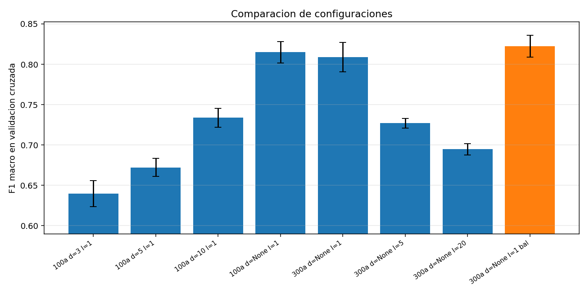
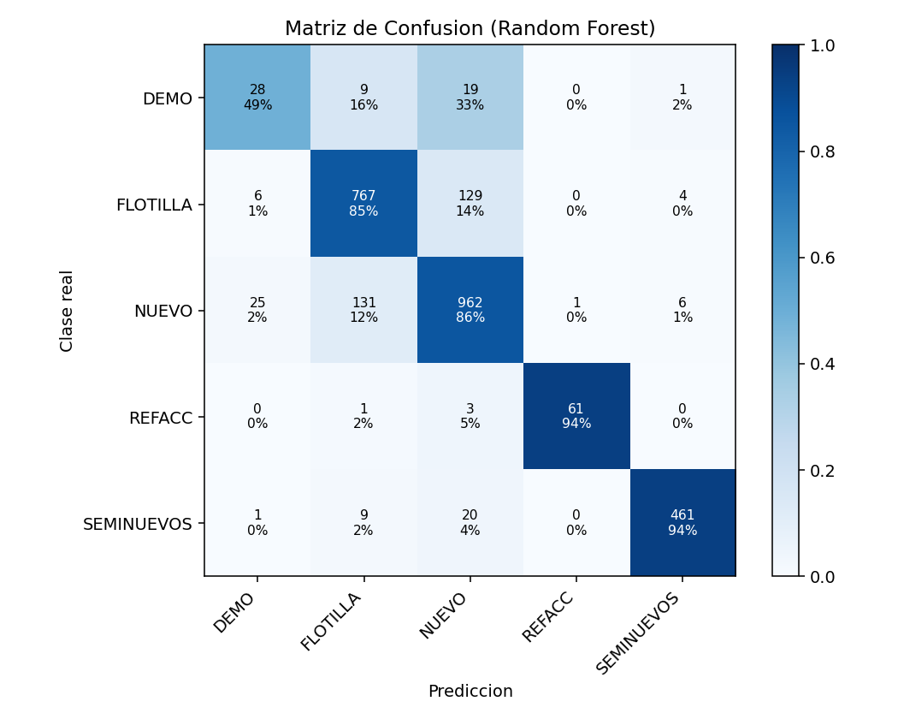
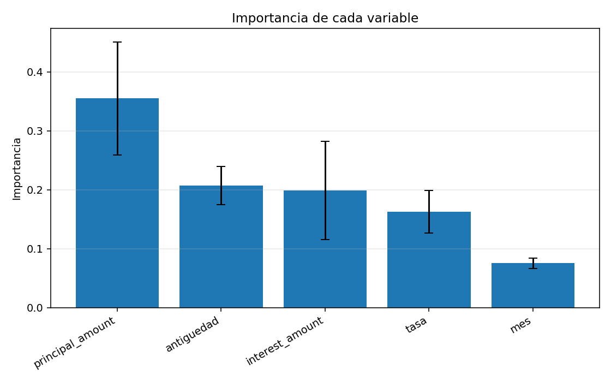
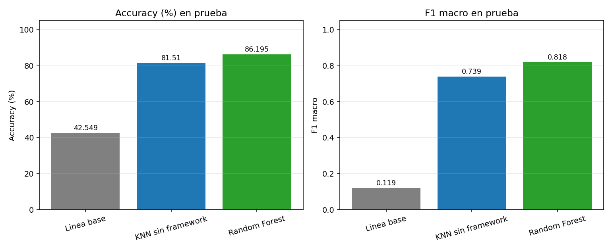

# Clasificación del tipo de garantía con Random Forest

**Santiago Serrano Montalvo · A01751347**
Módulo 2 · Portafolio de Implementación · Uso de framework de aprendizaje máquina

---

## 1. Resumen

Se implementó Random Forest con scikit-learn para clasificar el tipo de garantía de un crédito automotriz. El objetivo es el mismo de la entrega anterior, pero ahora resuelto con la biblioteca en lugar de programado a mano.

Se usó el mismo dataset y las mismas variables que en la implementación desde cero, para poder comparar los dos resultados. Todo está en un solo archivo `main.py`.

| Accuracy | F1 macro | Árboles | Datos de prueba |
|---:|---:|---:|---:|
| 86.20 % | 0.818 | 300 | 2,644 |

El modelo llega a 86.20 % de accuracy, casi 5 puntos por encima del KNN, y mejora sobre todo en la clase minoritaria DEMO, que pasa de un F1 de 0.187 a 0.479.

## 2. Cómo funciona Random Forest

Random Forest es un algoritmo basado en árboles de decisión. Un árbol va separando los datos con preguntas sobre las variables, por ejemplo "¿el monto principal es mayor a 300,000?". Cada respuesta lleva a otra pregunta hasta llegar a una clase.

El problema de usar un solo árbol es que se aprende demasiado bien los datos de entrenamiento y falla con datos nuevos. Random Forest lo resuelve entrenando muchos árboles a la vez:

1. Cada árbol se entrena con una muestra distinta de los datos, tomada al azar con reemplazo.
2. En cada corte, el árbol solo puede escoger entre algunas de las columnas, no entre todas.
3. Para predecir, cada árbol vota por una clase y gana la que tenga más votos.

La idea de fondo es que los errores de un árbol se compensan con los aciertos de los demás. El punto 2 es el que realmente hace que los árboles sean distintos entre sí: si todos pudieran usar todas las columnas en cada corte, terminarían casi idénticos y el bosque no aportaría nada sobre un solo árbol.

### 2.1 No hace falta normalizar

En la entrega anterior la normalización era necesaria porque KNN mide distancias y `principal`, cuyo valor está en cientos de miles, aplastaba por completo a `tasa`, que vive entre 0 y 0.01.

Random Forest no tiene ese problema. Los árboles no calculan distancias, separan los datos con cortes del tipo "principal > 300000", y un corte funciona igual sin importar la escala de la columna. Por eso aquí no hay ningún paso de normalización.

### 2.2 Por qué Random Forest para este problema

El KNN dejó ver dos problemas del dataset y Random Forest ataca los dos. Primero, NUEVO y FLOTILLA se traslapan: los árboles cortan cada variable por umbrales, lo que permite fronteras en escalones que una frontera por distancia no puede formar, y además al promediar 300 árboles se obtiene una probabilidad por clase y no solo un voto duro. Segundo, DEMO y REFACC son clases muy chicas: el parámetro `class_weight` permite reponderarlas dentro del criterio de división, algo que KNN por votación simple no ofrece.

## 3. Dataset

El archivo `interest_ledger.csv` tiene 10,576 renglones de intereses de piso. Cada renglón es el interés devengado por un vehículo durante un mes contable.

### 3.1 Variable objetivo

La columna `collateral` indica el tipo de garantía, con cinco clases. La distribución está muy desbalanceada y eso determina la métrica:

| Clase | Total | Entrenamiento | Prueba | Qué representa |
|---|---:|---:|---:|---|
| NUEVO | 4,498 | 3,373 | 1,125 | Vehículo nuevo |
| FLOTILLA | 3,625 | 2,719 | 906 | Vehículos a nombre de una empresa |
| SEMINUEVOS | 1,965 | 1,474 | 491 | Vehículo usado |
| REFACC | 259 | 194 | 65 | Crédito de refaccionamiento |
| DEMO | 229 | 172 | 57 | Auto nuevo usado como demostración |

NUEVO tiene casi 20 veces más casos que DEMO.

### 3.2 Variables de entrada

Se usaron exactamente las mismas cinco variables de la entrega pasada, para que la comparación sea justa:

| Variable | Descripción | Origen |
|---|---|---|
| `principal_amount` | Monto del crédito vigente en el mes | Directa |
| `interest_amount` | Interés devengado durante el mes | Directa |
| `tasa` | Interés por cada peso prestado | interés / principal |
| `antiguedad` | Años entre el modelo del vehículo y el mes contable | año contable − año modelo |
| `mes` | Mes del año, capta estacionalidad | De la fecha |

Igual que antes, la columna `collateral` trae espacios no separables (`\xa0`) pegados a cada valor y la carga los limpia.

### 3.3 Partición

Los datos se dividen con `train_test_split`, con semilla fija (`random_state=42`):

| Conjunto | Renglones | Proporción | Uso |
|---|---:|---:|---|
| Entrenamiento | 7,932 | 75 % | Ajusta los árboles y elige los parámetros |
| Prueba | 2,644 | 25 % | Nunca visto durante el ajuste |

**Por qué `stratify=y`.** Esta opción reparte cada clase en la misma proporción en entrenamiento y en prueba. Sin ella, con clases tan chicas como DEMO (229 casos) y REFACC (259) el azar podría dejar casi todos los ejemplos de un solo lado y las métricas de esas clases dejarían de significar algo.

## 4. La métrica elegida

La métrica principal es el **F1 macro**. Como de esta decisión depende qué modelo se selecciona, vale la pena justificarla.

**Por qué no el accuracy.** Con NUEVO en 42.5 % y DEMO en 2.2 %, un modelo que nunca predijera DEMO perdería como máximo 2.2 puntos de accuracy pero tendría F1 de 0 en esa clase. El accuracy no distingue entre un modelo que clasifica bien las cinco clases y uno que abandona las dos chicas. De hecho la referencia que siempre responde NUEVO ya obtiene 42.55 % sin aprender nada.

**Por qué no el F1 ponderado.** El F1 ponderado pondera cada clase por su número de ejemplos, así que arrastra el mismo sesgo hacia las clases mayoritarias.

**Por qué F1 macro.** Promedia el F1 de las cinco clases con el mismo peso:

$$
F_{1,\text{macro}} = \frac{1}{C}\sum_{c=1}^{C} F_{1,c}
$$

Una clase de 229 registros pesa tanto como una de 4,498. Si el modelo abandona DEMO, el F1 macro cae alrededor de 0.20 puntos.

**Por qué F1 y no solo recall.** El F1 es la media armónica de precisión y recall. Usar solo el recall premiaría a un modelo que predijera DEMO demasiado seguido: encontraría todos los DEMO pero marcaría mal muchos NUEVO. El F1 obliga a equilibrar las dos cosas.

Además se reportan el accuracy, el accuracy balanceado y la matriz de confusión completa, que es la que deja ver entre qué clases se confunde el modelo.

## 5. Configuración del modelo

```python
modelo = RandomForestClassifier(
    n_estimators=300,        # numero de arboles del bosque
    max_depth=None,          # hasta donde crece cada arbol
    min_samples_leaf=1,      # minimo de datos por hoja
    max_features="sqrt",     # cada corte ve solo algunas columnas
    class_weight="balanced", # peso de cada clase
    random_state=42,
    n_jobs=-1,               # usa todos los nucleos
)
```

| Parámetro | Valor | Para qué sirve |
|---|---|---|
| `n_estimators` | 300 | Número de árboles del bosque |
| `max_depth` | `None` | Deja que los árboles crezcan hasta separar los datos |
| `min_samples_leaf` | 1 | Mínimo de renglones que deben quedar en cada hoja |
| `max_features` | `"sqrt"` | En cada corte solo se consideran algunas columnas |
| `class_weight` | `"balanced"` | Compensa el desbalance entre clases |
| `random_state` | 42 | Semilla fija para que el resultado sea reproducible |
| `n_jobs` | -1 | Entrena usando todos los núcleos del procesador |

El bosque resultante tiene profundidad media de 26.5 y 824 hojas por árbol.

### 5.1 Selección de los parámetros

Para elegir esta configuración se usó validación cruzada estratificada de 5 particiones con `cross_val_score`, sobre el conjunto de entrenamiento. `StratifiedKFold` parte el entrenamiento en 5 bloques conservando la proporción de clases, el modelo se entrena 5 veces usando un bloque distinto como validación en cada vuelta, y se promedia.

El conjunto de prueba no se toca en este paso. Si se usara para elegir parámetros, su resultado dejaría de ser una estimación honesta del desempeño con datos nuevos.

| Árboles | `max_depth` | `min_samples_leaf` | `class_weight` | F1 macro (CV) | Desv. |
|---:|---:|---:|---|---:|---:|
| 100 | 3 | 1 | None | 0.6397 | 0.0163 |
| 100 | 5 | 1 | None | 0.6721 | 0.0112 |
| 100 | 10 | 1 | None | 0.7338 | 0.0118 |
| 100 | None | 1 | None | 0.8149 | 0.0132 |
| 300 | None | 1 | None | 0.8089 | 0.0182 |
| 300 | None | 5 | None | 0.7269 | 0.0061 |
| 300 | None | 20 | None | 0.6946 | 0.0072 |
| **300** | **None** | **1** | **balanced** | **0.8224** | **0.0135** |



Limitar la profundidad hace daño: con `max_depth=3` el F1 macro es 0.64 y sube a 0.81 al quitar el límite. Con árboles cortos el modelo no tiene capacidad para separar las clases.

Forzar hojas grandes también hace daño: pasar `min_samples_leaf` de 1 a 20 baja el F1 de 0.81 a 0.69. Con solo cinco variables, exigir 20 registros por hoja impide aislar las regiones pequeñas donde viven DEMO y REFACC.

`class_weight="balanced"` es lo que más ayuda, de 0.8089 a 0.8224. Este parámetro multiplica el peso de cada clase por el inverso de su frecuencia dentro del criterio de división, así que equivocarse en un DEMO cuesta unas 19 veces más que equivocarse en un NUEVO.

Las desviaciones son bajas (entre 0.006 y 0.018), lo que indica que las diferencias entre configuraciones son reales y no ruido de partición.

## 6. Resultados

| Conjunto | Accuracy | Accuracy balanceado | F1 macro | F1 ponderado |
|---|---:|---:|---:|---:|
| Entrenamiento | 98.42 % | 99.21 % | 0.9884 | 0.9842 |
| Prueba | 86.20 % | 81.41 % | 0.8180 | 0.8626 |

La brecha entre entrenamiento y prueba en F1 macro es de 0.1703. Eso es señal de sobreajuste y se analiza a fondo en la entrega de análisis.

### 6.1 Matriz de confusión

| Real / Predicción | DEMO | FLOTILLA | NUEVO | REFACC | SEMINUEVOS |
|---|---:|---:|---:|---:|---:|
| DEMO | 28 | 9 | 19 | 0 | 1 |
| FLOTILLA | 6 | 767 | 129 | 0 | 4 |
| NUEVO | 25 | 131 | 962 | 1 | 6 |
| REFACC | 0 | 1 | 3 | 61 | 0 |
| SEMINUEVOS | 1 | 9 | 20 | 0 | 461 |



### 6.2 Métricas por clase

| Clase | Precisión | Recall | F1 | n |
|---|---:|---:|---:|---:|
| DEMO | 0.467 | 0.491 | 0.479 | 57 |
| FLOTILLA | 0.836 | 0.847 | 0.841 | 906 |
| NUEVO | 0.849 | 0.855 | 0.852 | 1,125 |
| REFACC | 0.984 | 0.938 | 0.961 | 65 |
| SEMINUEVOS | 0.977 | 0.939 | 0.957 | 491 |
| **Macro** | **0.823** | **0.814** | **0.818** | 2,644 |

### 6.3 Importancia de las variables



| Variable | Importancia |
|---|---:|
| `principal_amount` | 0.3554 |
| `antiguedad` | 0.2072 |
| `interest_amount` | 0.1989 |
| `tasa` | 0.1630 |
| `mes` | 0.0755 |

La importancia mide la reducción de impureza que aporta cada variable a lo largo de todos los cortes. El monto del crédito es la variable dominante, seguida de la antigüedad. El mes es la menos informativa, lo cual tiene sentido porque el tipo de garantía no depende de la estacionalidad. Las barras de error muestran la desviación entre los 300 árboles y son estrechas, así que el orden es consistente.

## 7. Comparación con la entrega sin framework



| Modelo | Accuracy | F1 macro |
|---|---:|---:|
| Referencia (clase mayoritaria) | 42.55 % | 0.1194 |
| KNN sin framework (k=5) | 81.51 % | 0.7390 |
| **Random Forest** | **86.20 %** | **0.8180** |

Por clase:

| Clase | F1 con KNN | F1 con Random Forest | Cambio |
|---|---:|---:|---:|
| DEMO | 0.187 | **0.479** | **+0.292** |
| FLOTILLA | 0.765 | 0.841 | +0.076 |
| NUEVO | 0.809 | 0.852 | +0.043 |
| REFACC | 0.983 | 0.961 | −0.022 |
| SEMINUEVOS | 0.950 | 0.957 | +0.007 |

Casi toda la ganancia viene de DEMO. El recall de esa clase sube de 0.140 a 0.491: el KNN encontraba 7 de 50 casos y el Random Forest encuentra 28 de 57.

La explicación es directa. En KNN la votación por mayoría favorece a las clases numerosas: con 172 ejemplos de DEMO contra 3,373 de NUEVO es muy poco probable que los 5 vecinos más cercanos de un DEMO sean también DEMO. `class_weight="balanced"` ataca ese mecanismo desde dentro del criterio de división. REFACC baja un poco porque el reponderado la hace más propensa a falsos negativos, pero la ganancia neta es claramente positiva.

Además del resultado, el framework aporta cosas que habría que programar a mano: la partición estratificada con `stratify`, la validación cruzada con `StratifiedKFold`, la reponderación de clases, las probabilidades por clase con `predict_proba` y la paralelización con `n_jobs=-1`.

## 8. Predicciones

El programa clasifica cuatro créditos que no están en el dataset. Además de la clase se muestra `predict_proba`, que es la proporción de los 300 árboles que votó por cada clase:

```
 Credito mediano, vehiculo de un año
   principal $350,000.00 | interes $1,500.00 | antiguedad 1 | mes 2
   PREDICCION: NUEVO
   confianza: NUEVO 85.7%  FLOTILLA 6.7%  DEMO 6.3%  SEMINUEVOS 1.3%

 Credito muy grande, vehiculo del año
   principal $1,200,000.00 | interes $9,000.00 | antiguedad 0 | mes 5
   PREDICCION: NUEVO
   confianza: NUEVO 37.7%  DEMO 29.7%  FLOTILLA 24.7%  REFACC 8.0%

 Credito chico, vehiculo con 4 años
   principal $90,000.00 | interes $400.00 | antiguedad 4 | mes 8
   PREDICCION: SEMINUEVOS
   confianza: SEMINUEVOS 64.0%  REFACC 36.0%

 Credito muy chico, vehiculo con 2 años
   principal $45,000.00 | interes $260.00 | antiguedad 2 | mes 11
   PREDICCION: SEMINUEVOS
   confianza: SEMINUEVOS 74.3%  REFACC 25.7%
```

El primer caso se predice con 85.7 % de confianza y el segundo con apenas 37.7 % frente a 29.7 % de DEMO. Ese número sirve como umbral de decisión: se podrían aceptar automáticamente las predicciones arriba de, por ejemplo, 70 % y mandar el resto a revisión. Esa información no existía en el KNN, que solo devolvía un reparto de 5 votos. El segundo caso, un crédito de 1.2 millones sobre un vehículo del año, es genuinamente ambiguo y el modelo lo refleja repartiendo sus votos en tres clases.

## 9. Análisis

SEMINUEVOS y REFACC siguen siendo las clases con mejores resultados, igual que con KNN, porque ocupan regiones bien delimitadas: REFACC por sus montos bajos y SEMINUEVOS por la antigüedad del vehículo. La precisión de REFACC es 0.984, así que de 62 créditos marcados como refaccionaria 61 lo eran.

DEMO mejora bastante respecto al KNN aunque sigue siendo la clase más débil, con F1 de 0.479.

La confusión entre NUEVO y FLOTILLA no se resuelve: 131 NUEVO predichos como FLOTILLA y 129 FLOTILLA predichos como NUEVO, en total 260 errores que son el 71 % de todos los errores. Esto no es un defecto del algoritmo. Un crédito de flotilla es financieramente un crédito de auto nuevo y lo que los distingue es el tipo de acreditado, que no está en ninguna de las cinco variables. Que dos algoritmos con mecanismos completamente distintos fallen en el mismo lugar y en proporciones parecidas confirma que el límite está en los datos.

Sobre el sobreajuste: el modelo llega a 98.42 % en entrenamiento contra 86.20 % en prueba. Con 824 hojas por árbol y 7,932 registros, cada hoja tiene en promedio menos de 10 registros, así que el bosque está memorizando parte del entrenamiento. El diagnóstico completo de sesgo, varianza y las técnicas de regularización para corregirlo son el contenido de la entrega de análisis, donde ajustando `max_features`, `max_depth` y `ccp_alpha` la brecha baja de 0.21 a 0.13 y el F1 macro en prueba sube a 0.838.

## 10. Conclusión

El framework está aplicado correctamente: partición estratificada, selección de hiperparámetros con validación cruzada sin tocar el conjunto de prueba, configuración explícita del estimador y evaluación con matriz de confusión y reporte por clase.

El modelo alcanza 86.20 % de accuracy y 0.8180 de F1 macro sobre 2,644 registros de prueba, contra 42.55 % y 0.1194 de la referencia, y clasifica créditos nuevos desde la consola con su nivel de confianza.

La métrica está elegida y justificada: el F1 macro, porque el dataset está desbalanceado 19 a 1 y el objetivo es clasificar bien las cinco garantías, no solo las frecuentes.

Random Forest supera al KNN en 4.69 puntos de accuracy y 0.079 de F1 macro, con la mejora concentrada casi por completo en DEMO gracias a `class_weight="balanced"`.

El límite que queda es de los datos y no del algoritmo. Agregar el tipo de acreditado al dataset sería la mejora individual de mayor impacto. También se podría probar Gradient Boosting, que suele superar a Random Forest en datos tabulares.

---

Para reproducir los resultados: `cd M2_ConFramework && python3 main.py`. Requiere pandas, numpy, scikit-learn y matplotlib. Las figuras quedan en `figuras/` y la salida completa en `salida.txt`.
