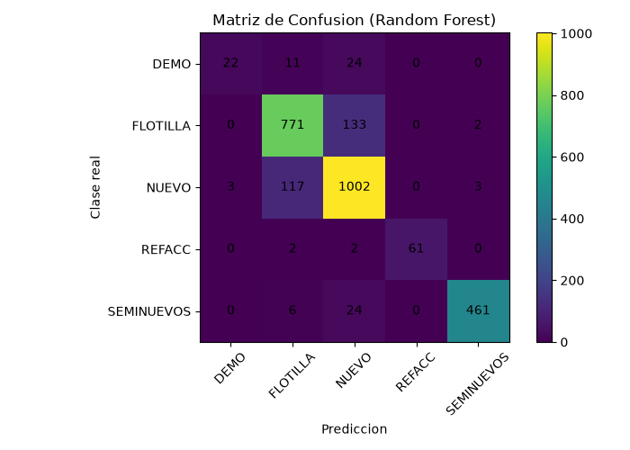
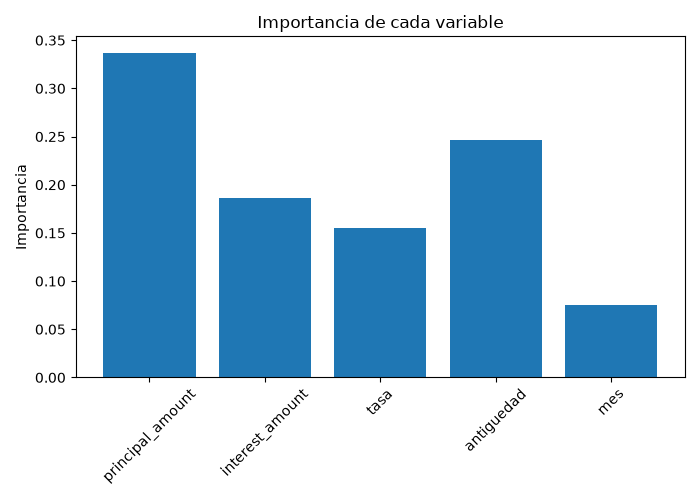

# Clasificación del tipo de garantía con Random Forest

Implementación de una técnica de aprendizaje máquina con framework (scikit-learn)

Santiago Serrano Montalvo · A01751347

Momento de Retroalimentación · Módulo 2 · TC3009 | Subcompetencia SMA0401A

## 1. Resumen

Se implementó el algoritmo Random Forest utilizando el framework scikit-learn para clasificar el tipo de garantía de un crédito automotriz. El objetivo es el mismo de la entrega anterior, pero ahora el se resuelven con la biblioteca en lugar de programarse a mano.

Se utilizó el mismo dataset y las mismas variables que en la implementación hecha desde cero, para poder comparar los dos resultados. La implementación completa vive en un solo archivo `main.py` 

| Accuracy | F1 macro | Árboles | Datos de prueba |
| -------: | -------: | -------: | --------------: |
|  87.63 % |    0.837 |      300 |           2,644 |

El modelo alcanza 87.63 % de accuracy sobre el conjunto de prueba, más de 6 puntos por encima del KNN programado desde cero, y mejora sobre todo en la clase minoritaria DEMO, que pasó de un F1 de 0.187 a 0.537.

## 2. El algoritmo: cómo funciona Random Forest

Random Forest es un algoritmo de clasificación basado en árboles de decisión. Un árbol de decisión va separando los datos con preguntas sobre las variables, por ejemplo "el monto principal es mayor a 300,000?". Cada respuesta lleva a otra pregunta hasta llegar a una clase.

El problema de usar un solo árbol es que se aprende demasiado bien los datos de entrenamiento y falla con datos nuevos. Random Forest resuelve esto entrenando muchos árboles a la vez:

1. Cada árbol se entrena con una muestra distinta de los datos, tomada al azar.
2. En cada corte, el árbol solo puede escoger entre algunas de las columnas, no entre todas.
3. Para predecir, cada árbol vota por una clase y gana la que tenga más votos.

La idea de fondo es que los errores de un árbol se compensan con los aciertos de los demás

### 2.1 No hace falta normalizar

En la entrega anterior la normalización era necesaria porque KNN mide distancias y la variable `principal`, que su valor esta en cientos de miles, aplastaba por completo a `tasa`, que vive entre 0 y 0.01.

Random Forest no tiene ese problema. Los árboles no calculan distancias, separan los datos por cortes del tipo "principal > 300000", y un corte funciona igual sin importar la escala de la columna. Por eso en esta implementación no hay ningún paso de normalización.

## 3. Dataset

El archivo `interest_ledger.csv` contiene 10,576 renglones de intereses de piso de una muestra de Nissan. Cada renglón representa el interés devengado por un vehículo durante un mes contable.

### 3.1 Variable objetivo

La columna `collateral` indica el tipo de garantía del crédito, con cinco clases posibles. La distribución está fuertemente desbalanceada, hecho determinante para elegir la métrica:

| Clase      | Renglones totales | En entrenamiento | Qué representa                     |
| ---------- | ----------------: | ---------------: | ----------------------------------- |
| NUEVO      |             4,498 |            3,373 | Vehículo nuevo                     |
| FLOTILLA   |             3,625 |            2,719 | Vehículos a nombre de una empresa  |
| SEMINUEVOS |             1,965 |            1,474 | Vehículo usado                     |
| REFACC     |               259 |              194 | Crédito de refaccionamiento        |
| DEMO       |               229 |              172 | Auto nuevo usado como demostración |

NUEVO tiene casi 20 veces más casos que DEMO. Esta diferencia es la que obliga a reportar algo más que el accuracy, como se explica en la sección 5.

### 3.2 Variables de entrada

Se usaron exactamente las mismas cinco variables de la entrega pasada, para que la comparación entre los dos algoritmos sea justa:

| Variable             | Descripción                                          | Origen                       |
| -------------------- | ----------------------------------------------------- | ---------------------------- |
| `principal_amount` | Monto del crédito vigente en el mes                  | Directa                      |
| `interest_amount`  | Interés devengado durante el mes                     | Directa                      |
| `tasa`             | Interés por cada peso prestado                       | interes / principal          |
| `antiguedad`       | Años entre el modelo del vehículo y el mes contable | año contable – año modelo |
| `mes`              | Mes del año, capta estacionalidad                    | De la fecha                  |

Igual que en la entrega anterior, la columna `collateral` del export original trae espacios no separables (`\xa0`) pegados a cada valor, de modo que `"NUEVO\xa0"` y `"NUEVO"` se leerían como clases distintas. La carga de datos los limpia antes de usar la etiqueta.

### 3.3 Partición entrenamiento / prueba

Los datos se dividen con la función `train_test_split` de scikit-learn, con semilla fija (`random_state=42`) para que el resultado sea reproducible en cualquier ejecución.

| Conjunto      | Renglones | Proporción | Uso                                             |
| ------------- | --------: | ----------: | ----------------------------------------------- |
| Entrenamiento |     7,932 |        75 % | Ajusta los árboles y elige los parámetros     |
| Prueba        |     2,644 |        25 % | Nunca visto durante el ajuste; sirve para medir |

**Por qué `stratify=y`.** Esta opción reparte cada clase en la misma proporción en entrenamiento y en prueba. Sin ella, con clases tan chicas como DEMO (229 casos) y REFACC (259) el azar podría dejar casi todos los ejemplos de un solo lado y las métricas de esas clases dejarían de significar algo.

## 4. Configuración del modelo

El modelo se construye con la clase `RandomForestClassifier`. La configuración final es la siguiente:

```python
modelo = RandomForestClassifier(
    n_estimators=300,       # numero de arboles del bosque
    max_depth=None,         # los arboles crecen hasta separar bien los datos
    min_samples_leaf=1,     # minimo de datos que debe quedar en cada hoja
    max_features="sqrt",    # cada corte solo considera algunas columnas
    class_weight=None,      # probe "balanced" y bajo el F1 macro
    random_state=SEMILLA,
    n_jobs=-1,              # usa todos los nucleos del procesador
)
```

| Parámetro           | Valor      | Para qué sirve                                               |
| -------------------- | ---------- | ------------------------------------------------------------- |
| `n_estimators`     | 300        | Número de árboles que se entrenan en el bosque              |
| `max_depth`        | `None`   | Deja que los árboles crezcan hasta separar bien los datos    |
| `min_samples_leaf` | 1          | Mínimo de renglones que deben quedar en cada hoja            |
| `max_features`     | `"sqrt"` | En cada corte solo se consideran algunas columnas             |
| `class_weight`     | `None`   | Todas las clases pesan igual (se probó`"balanced"`)        |
| `random_state`     | 42         | Semilla fija para que el resultado sea reproducible           |
| `n_jobs`           | -1         | Entrena los árboles usando todos los núcleos del procesador |

El parámetro `max_features="sqrt"` es el que hace que los árboles sean distintos entre sí. Si todos pudieran usar todas las columnas en cada corte, terminarían siendo casi idénticos y el bosque no aportaría nada sobre un solo árbol.

### 4.1 Selección de los parámetros

Para elegir esta configuración se usó validación cruzada con `cross_val_score`, que parte el entrenamiento en 5 pedazos y ajusta el modelo 5 veces, usando un pedazo distinto como validación en cada vuelta y promediando al final.

| Árboles | Profundidad | Pesos de clase | F1 macro (validación cruzada) |
| -------: | ----------: | -------------- | -----------------------------: |
|      100 |           5 | ninguno        |                          0.668 |
|      100 |          10 | ninguno        |                          0.718 |
|      100 |    sin tope | ninguno        |                          0.818 |
|      300 |    sin tope | ninguno        |                          0.820 |
|      300 |    sin tope | `balanced`   |                          0.823 |

**Limitar la profundidad empeora el modelo.** Con profundidad 5 el F1 macro cae hasta 0.668: los árboles quedan demasiado simples y no alcanzan a separar las clases.

**Pasar de 100 a 300 árboles casi no cambia nada** (0.818 a 0.820). Aun así se dejaron 300 porque el resultado es un poco más estable y el entrenamiento sigue tardando segundos.

**`class_weight="balanced"` quedó prácticamente empatado** (0.823 contra 0.820, una diferencia de 0.003). Como la diferencia es tan pequeña se prefirió la configuración más simple; en la sección 8 se analiza qué pasó al probar las dos contra el conjunto de prueba.

**Prevención de fuga de información.** Toda esta comparación se hizo únicamente con los datos de entrenamiento. Si los parámetros se eligieran mirando el conjunto de prueba, ese conjunto dejaría de ser una medida honesta del desempeño: el modelo estaría usando datos del examen para prepararse.

## 5. Métrica elegida

La métrica principal de este reporte es el **F1 macro**. El F1 de una clase combina precisión y recall en un solo número, y el F1 macro es el promedio simple del F1 de todas las clases, donde cada clase pesa lo mismo sin importar cuántos renglones tenga.

$$
F1 = \frac{2 \cdot precision \cdot recall}{precision + recall}
$$

| Métrica   | Fórmula           | Qué responde                                                              |
| ---------- | ------------------ | -------------------------------------------------------------------------- |
| Precisión | TP / (TP + FP)     | De todo lo que predije como esta clase, ¿cuánto acerté?                 |
| Recall     | TP / (TP + FN)     | De todos los casos que realmente eran de esta clase, ¿cuántos encontré? |
| F1         | 2·P·R / (P + R)  | Balance entre ambas; penaliza que una sea alta a costa de la otra          |
| F1 macro   | promedio de los F1 | ¿El modelo funciona en todas las clases o solo en las grandes?            |

**Por qué el accuracy no basta.** El accuracy se lo llevan las clases grandes: en este dataset NUEVO y FLOTILLA juntas son el 77 % de los renglones. Un modelo que clasificara bien solo esas dos y fallara por completo en DEMO y REFACC tendría un accuracy alto y aun así sería un mal modelo.

El F1 macro no permite eso. Como cada clase pesa igual en el promedio, basta con que el modelo falle en DEMO para que el número baje de inmediato. Eso es justo lo que ocurre aquí: el accuracy queda en 87.63 % pero el F1 macro en 0.837, y la diferencia entre los dos números es exactamente el costo de la clase minoritaria.

De todas formas se reportan las dos métricas, más el F1 ponderado, la matriz de confusión completa y la precisión y el recall de cada clase por separado. El accuracy responde "de todos los créditos, ¿cuántos clasifiqué bien?" y el F1 macro responde "¿el modelo sirve para todas las clases?".

## 6. Resultados

El modelo se entrenó con los 7,932 renglones de entrenamiento y se evaluó con los 2,644 de prueba, que nunca vio durante el ajuste.

| Métrica     | Resultado | Lectura                                                       |
| ------------ | --------: | ------------------------------------------------------------- |
| Accuracy     |   87.63 % | 88 de cada 100 créditos de prueba quedaron bien clasificados |
| F1 macro     |     0.837 | Promedio por clase; lo baja DEMO                              |
| F1 ponderado |     0.875 | Promedio pesado por el tamaño de cada clase                  |

### 6.1 Matriz de confusión

La matriz cruza la clase real (renglones) contra la predicción (columnas). La diagonal contiene los aciertos; todo lo que queda fuera son errores, y su posición indica exactamente qué clase se confundió con cuál.

| Real \ Predicho | DEMO | FLOTILLA | NUEVO | REFACC | SEMINUEVOS |
| --------------- | ---: | -------: | ----: | -----: | ---------: |
| DEMO            |   22 |       11 |    24 |      0 |          0 |
| FLOTILLA        |    0 |      771 |   133 |      0 |          2 |
| NUEVO           |    3 |      117 |  1002 |      0 |          3 |
| REFACC          |    0 |        2 |     2 |     61 |          0 |
| SEMINUEVOS      |    0 |        6 |    24 |      0 |        461 |



*Figura 1. Matriz de confusión del Random Forest sobre los 2,644 datos de prueba. El bloque brillante de la diagonal concentra los aciertos.*

Los 327 errores del modelo no están repartidos parejo, se concentran en dos zonas:

* **NUEVO y FLOTILLA se confunden entre ellas.** 133 créditos FLOTILLA se predijeron como NUEVO y 117 NUEVO se predijeron como FLOTILLA. Esos 250 casos son la mayoría de todos los errores.
* **DEMO casi no se detecta.** De 57 créditos DEMO reales, el modelo solo encontró 22; los otros 35 se fueron a NUEVO y FLOTILLA.

REFACC y SEMINUEVOS, en cambio, casi no tienen errores fuera de la diagonal.

### 6.2 Métricas por clase

| Clase      | Precisión | Recall |    F1 | Casos de prueba |
| ---------- | ---------: | -----: | ----: | --------------: |
| DEMO       |      0.880 |  0.386 | 0.537 |              57 |
| FLOTILLA   |      0.850 |  0.851 | 0.851 |             906 |
| NUEVO      |      0.846 |  0.891 | 0.868 |           1,125 |
| REFACC     |      1.000 |  0.938 | 0.968 |              65 |
| SEMINUEVOS |      0.989 |  0.939 | 0.963 |             491 |

El caso más interesante es DEMO: precisión de 0.880 contra un recall de 0.386. Cuando el modelo dice "esto es DEMO" casi siempre tiene razón, pero se le escapan dos de cada tres DEMO que sí existían. Es un modelo muy exigente para poner esa etiqueta, y por eso la pone pocas veces.

REFACC llega a una precisión de 1.000: los 61 créditos que el modelo marcó como REFACC eran realmente REFACC.

### 6.3 Importancia de las variables

Una ventaja de usar el framework es que el modelo entrenado guarda qué tanto ayudó cada variable a separar las clases, en el atributo `feature_importances_`. Programar esto a mano habría sido bastante más tardado.

| Variable        | Importancia | Por qué tiene sentido                                                                |
| --------------- | ----------: | ------------------------------------------------------------------------------------- |
| Monto principal |       0.337 | Un auto nuevo, uno seminuevo y una refacción cuestan cantidades muy distintas        |
| Antigüedad     |       0.246 | Es prácticamente la definición de si un auto es nuevo o seminuevo                   |
| Interés        |       0.186 | Depende del monto y del plazo del crédito                                            |
| Tasa            |       0.155 | Separa bien los créditos de refaccionamiento                                         |
| Mes             |       0.075 | El mes del pago no debería decir nada sobre la garantía, y en efecto casi no aporta |



*Figura 2. Importancia de cada variable. El monto principal y la antigüedad concentran más de la mitad del peso del modelo.*

## 7. Predicciones

El programa hace predicciones sobre tres créditos inventados, como si llegaran registros nuevos que todavía no tienen garantía asignada. Estas predicciones se imprimen en consola al ejecutar `main.py`.

Además de la clase predicha con `predict`, se muestra la probabilidad de cada clase con `predict_proba`, que es el porcentaje de árboles del bosque que votaron por ella.

| Caso | Principal | Interés | Antigüedad | Mes | Predicción | Confianza |
| ---: | --------: | -------: | ----------: | --: | ----------- | --------: |
|    1 |   350,000 |    1,500 |           1 |   2 | NUEVO       |    93.7 % |
|    2 | 1,200,000 |    9,000 |           0 |   5 | NUEVO       |    63.7 % |
|    3 |    90,000 |      400 |           4 |   8 | SEMINUEVOS  |    79.0 % |

El caso 1 es un crédito común y corriente, y el bosque lo clasifica con 93.7 % de confianza. El caso 3 es un crédito chico de un vehículo de cuatro años y se manda a SEMINUEVOS con 79.0 %.

El caso 2 es el interesante: un crédito muy grande, de 1,200,000. El modelo predice NUEVO pero solo con 63.7 % y reparte el resto entre DEMO (22.3 %) y FLOTILLA (13.7 %). Montos así son raros en el dataset, y la probabilidad lo refleja. Poder ver estos números es útil porque permite distinguir una predicción segura de una en la que el modelo apenas se decidió.

## 8. Análisis

Las clases **REFACC y SEMINUEVOS se clasifican muy bien**, las dos con F1 arriba de 0.96. Sus características numéricas son muy distintas a las demás: REFACC son créditos de montos bajos y SEMINUEVOS son vehículos con más antigüedad, así que el modelo las separa sin problema aunque REFACC tenga apenas 65 casos de prueba.

Los **errores principales están entre NUEVO y FLOTILLA**. Estas dos clases se parecen mucho en las variables que se usaron, porque un crédito de flotilla es también de autos nuevos, solo que a nombre de una empresa. La diferencia real no está en el monto ni en la antigüedad, sino en quién es el cliente, y esa información no se le está dando al modelo.

La clase **DEMO es la más difícil**. Solo tiene 229 renglones en todo el dataset y además es un auto nuevo usado como demostración, así que sus números se parecen mucho a los de NUEVO. El resultado es un recall de apenas 0.386.

**El desbalance no era todo el problema.** Al probar `class_weight="balanced"`, que le da más peso a las clases chicas, el recall de DEMO subió de 0.386 a 0.491 pero su precisión se desplomó de 0.880 a 0.467, y el F1 macro general bajó de 0.837 a 0.818. Es decir, el modelo empezó a etiquetar más cosas como DEMO pero equivocándose casi la mitad de las veces. Esto apunta a que las variables disponibles no alcanzan a distinguir un DEMO de un NUEVO, y que el problema no se arregla solo pesando las clases.

**El modelo no está sobreajustado.** El F1 macro de la validación cruzada fue 0.820 y el de los datos de prueba 0.837, valores muy parecidos. Si el bosque se hubiera aprendido de memoria el entrenamiento, el resultado en prueba habría caído bastante por debajo del de validación.

### 8.1 Comparación con la implementación sin framework

Como se usó el mismo dataset, las mismas variables y la misma proporción de partición, los dos modelos se pueden comparar directamente.

| Modelo                        | Accuracy | F1 macro | F1 de DEMO |
| ----------------------------- | -------: | -------: | ---------: |
| KNN k=5 programado desde cero |  81.51 % |    0.739 |      0.187 |
| Random Forest (scikit-learn)  |  87.63 % |    0.837 |      0.537 |

El Random Forest mejora el accuracy en poco más de 6 puntos y el F1 macro en casi 0.10, pero la diferencia más grande está en DEMO, donde casi triplica el F1.

Esto se explica por cómo funciona cada algoritmo. KNN decide por distancia, así que en una clase con muy pocos datos los vecinos más cercanos casi siempre son de otra clase y DEMO nunca gana la votación. Random Forest, en cambio, puede construir ramas específicas para separar esos casos aunque sean pocos.

Además, con el framework el programa quedó mucho más corto y el entrenamiento tarda segundos, mientras que el KNN desde cero tiene que calcular la distancia de cada punto de prueba contra los 7,932 de entrenamiento cada vez que predice.

## 9. Conclusión

Se implementó un clasificador Random Forest con el framework scikit-learn, se entrenó con 7,932 renglones y se evaluó con 2,644 que el modelo nunca vio, alcanzando 87.63 % de accuracy y 0.837 de F1 macro. El programa es capaz de hacer predicciones sobre créditos nuevos indicando además con qué probabilidad los clasifica, y corre desde la terminal en un solo archivo `.py`.

Comparado con el KNN programado desde cero, el framework no solo dio un mejor resultado con menos código: también permitió hacer con una línea cosas que habrían sido muy tardadas de programar a mano, como la validación cruzada para elegir los parámetros, la partición estratificada y el cálculo de la importancia de cada variable.

Como mejora futura, lo que más ayudaría no sería cambiar el algoritmo sino agregar variables nuevas. Los errores del modelo están concentrados entre NUEVO, FLOTILLA y DEMO, y esas tres clases se distinguen más por el tipo de cliente que por los montos del crédito, así que una variable que indique si el cliente es persona o empresa probablemente eliminaría la mayor parte de los errores que quedan.
