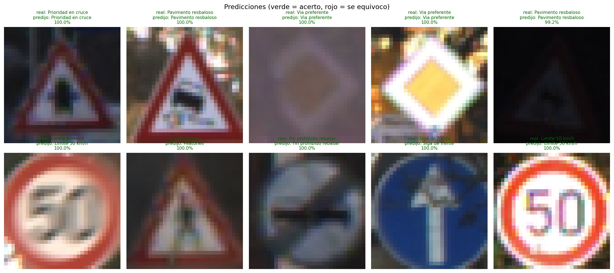

# Reconocimiento de señales de tránsito con una red convolucional

**Santiago Serrano Montalvo · A01751347**
Módulo 2 · Portafolio de Implementación · Modelo de deep learning

---

## 1. El problema

Clasificar en cuál de 43 señales de tránsito corresponde una fotografía tomada desde un vehículo en movimiento.

Es el problema de percepción más básico de un sistema de asistencia al conductor: si el vehículo no lee la señal, no puede avisar que el límite bajó a 30 ni que viene un alto. También es un problema con un requisito de precisión alto, porque confundir "límite 80" con "límite 30" tiene consecuencias reales, y con condiciones de captura difíciles: la cámara va en movimiento, la luz cambia todo el tiempo y la señal puede aparecer a 15 píxeles o a 250.

## 2. El dataset: GTSRB

GTSRB (German Traffic Sign Recognition Benchmark) son fotografías reales capturadas por una cámara montada en un auto circulando por carreteras de Alemania. Se publicó para la competencia IJCNN 2011 y sigue siendo la referencia estándar para este problema.

| | |
|---|---|
| Imágenes de entrenamiento | 39,209 |
| Imágenes de prueba | 12,630 (conjunto oficial) |
| Clases | 43 |
| Tamaño original | variable, de 15×15 a 250×250 píxeles |

No es un dataset sintético ni un ejemplo de clase. Las imágenes traen desenfoque de movimiento, sombras duras, contraluz, señales parcialmente tapadas y mucha variación de tamaño según la distancia.


### 2.1 Las pistas

Las imágenes de entrenamiento no son independientes entre sí. Cada señal física se fotografió **30 veces seguidas** mientras el auto se le acercaba, y esas 30 fotos forman una *pista*. Se reconocen por el nombre del archivo:

```
00012_00007.ppm
^^^^^ pista     ^^^^^ cuadro dentro de la pista
```

Las 30 fotos de una pista son casi idénticas: la misma señal, el mismo poste, el mismo fondo, tomadas con fracciones de segundo de diferencia.

Si la validación se separara al azar, cuadros de la misma señal física caerían en entrenamiento y en validación a la vez. El modelo sacaría una puntuación inflada por reconocer una foto casi repetida, no por generalizar a señales que nunca vio. Por eso **la separación se hace por pista completa**: una señal física está entera en entrenamiento o entera en validación.

```
      pistas totales      : 1307
      pistas a validacion : 261  (20%)
      imagenes train      : 31380
      imagenes validacion : 7829
```

### 2.2 Los tres conjuntos

| Conjunto | Imágenes | Origen |
|---|---:|---|
| Entrenamiento | 31,380 | 1,046 pistas |
| Validación | 7,829 | 261 pistas distintas |
| Prueba | 12,630 | conjunto oficial de GTSRB |

El conjunto de prueba es el oficial del benchmark, así que el resultado se puede comparar con lo publicado.

### 2.3 Desbalance

El dataset refleja la frecuencia real con la que aparece cada señal en carretera. La clase más común (Límite 50 km/h) tiene 1,800 imágenes de entrenamiento y las menos comunes (Límite 20, Peatones, Fin de restricciones, Siga de frente o izquierda) tienen 180 cada una, una proporción de 10 a 1. Por eso se reporta el F1 macro además del accuracy: promedia las 43 clases con el mismo peso y deja ver si el modelo está abandonando las señales poco frecuentes.

### 2.4 Preprocesamiento

El dataset incluye las coordenadas del rectángulo que contiene la señal. Se recorta por ahí, lo que quita el asfalto, el cielo y los árboles y hace que la señal ocupe siempre una porción parecida de la imagen. Después se redimensiona todo a 32×32 en color y se normaliza por canal con la media y la desviación calculadas solo con entrenamiento:

| Canal | Media | Desviación |
|---|---:|---:|
| R | 0.3190 | 0.2596 |
| G | 0.2871 | 0.2415 |
| B | 0.3061 | 0.2528 |

Las medias bajas, alrededor de 0.3 sobre 1.0, confirman que buena parte del dataset son imágenes oscuras.

## 3. Por qué una red convolucional

Una imagen de 32×32 en color tiene 3,072 números. Una capa densa conectada a todos ellos tendría que aprender por separado que un borde rojo en la esquina superior izquierda significa lo mismo que un borde rojo en el centro.

La convolución resuelve eso con dos propiedades. Los **pesos compartidos**: un filtro de 3×3 se desliza por toda la imagen, así que los mismos 9 pesos detectan el borde esté donde esté y la forma se aprende una sola vez. Y la **localidad**: cada neurona solo mira una vecindad pequeña, así que al apilar capas el campo receptivo crece, y la primera capa ve bordes, la segunda esquinas y arcos, y la tercera la silueta completa del triángulo o del círculo.

Eso es lo que hace que la arquitectura sea profunda en el sentido útil: la jerarquía de representaciones se construye sola, capa sobre capa, en lugar de diseñarse a mano. Un perceptrón multicapa sobre los píxeles crudos no tiene ninguna de las dos propiedades.

## 4. Modelo A — aproximación inicial

```
entrada 3 x 32 x 32
  Conv 3->32   ReLU   Conv 32->32   ReLU   MaxPool  -> 32 x 16 x 16
  Conv 32->64  ReLU   Conv 64->64   ReLU   MaxPool  -> 64 x  8 x  8
  aplanado (4096)  ->  Densa 512  ReLU  ->  Densa 43
```

| | |
|---|---|
| Parámetros | 2,185,291 |
| Optimizador | Adam con tasa fija de 1e-3 |
| Regularización | ninguna |
| Aumento de datos | no |
| Épocas | 30 |

Es a propósito la versión ingenua: la arquitectura que sale de aplicar la receta básica sin pensar en generalización. Sirve como punto de partida y para que el problema se vea claro.

### 4.1 Qué pasó al entrenar

| Época | Pérdida train | Acc train | Pérdida val | Acc val |
|---:|---:|---:|---:|---:|
| 1 | 0.9699 | 72.24 % | 0.3140 | 92.12 % |
| 3 | 0.0328 | 99.07 % | 0.2075 | 96.22 % |
| 10 | 0.0088 | 99.77 % | 0.1716 | 97.34 % |
| 14 | 0.0101 | 99.73 % | 0.1629 | 97.10 % |
| 20 | 0.0002 | 100.00 % | 0.1513 | 97.27 % |
| 25 | 0.0000 | 100.00 % | 0.1635 | 97.74 % |
| 30 | 0.0000 | 100.00 % | 0.1736 | 97.74 % |

Lo importante está en la columna de pérdida de validación, no en la de accuracy.

A partir de la época 20 la pérdida de entrenamiento es exactamente 0.0000: el modelo memorizó las 31,380 imágenes. De ahí en adelante el accuracy de validación se queda parado alrededor de 97.7 %, pero la pérdida de validación **empieza a subir**, de 0.1513 en la época 20 a 0.1736 en la 30.

Esas dos cosas juntas significan que el modelo sigue cambiando después de haber memorizado, y que cada cambio lo vuelve más confiado en sus errores. Acierta el mismo número de casos pero cuando falla lo hace con más seguridad, lo cual es peor que un error dudoso porque destruye la utilidad del nivel de confianza.

### 4.2 Resultados

| Conjunto | Accuracy | F1 macro |
|---|---:|---:|
| Entrenamiento | 100.00 % | 1.0000 |
| Validación | 97.74 % | 0.9676 |
| Prueba | 97.18 % | 0.9550 |

Brecha entrenamiento − validación: **2.26 puntos porcentuales**. El modelo llega al 100 % en lo que ya vio y baja a 97.74 % en datos nuevos. Son 356 errores sobre las 12,630 imágenes de prueba.

## 5. Modelo B — versión mejorada

### 5.1 Los ocho cambios

| Cambio | Qué problema ataca |
|---|---|
| BatchNorm tras cada convolución | entrenamiento inestable; normaliza las activaciones de cada lote y permite una tasa más alta |
| Dropout creciente (0.2 / 0.3 / 0.4 / 0.5) | memorización; apaga neuronas al azar, poco al principio porque las primeras capas detectan bordes y mucho al final que es donde se memoriza |
| Un tercer bloque convolucional | campo receptivo corto; deja que la red arme la silueta completa |
| Global average pooling en vez de aplanar | exceso de parámetros densos, ver abajo |
| Aumento de datos | poca variedad de ejemplos |
| Weight decay 1e-4 | penalización L2 que empuja los pesos hacia cero |
| Decaimiento coseno de la tasa | avanzar rápido al inicio y afinar al final |
| Early stopping con paciencia de 8 | entrenar de más |

El cuarto cambio es el más importante. Aplanar 64×8×8 hacia una densa de 512 costaba 2.1 millones de pesos, o sea casi todos los del Modelo A, y es justo donde ocurre la memorización. Promediar cada mapa de activación deja 128 números. El resultado es que **el Modelo B tiene 7.1 veces menos parámetros** (309,771 contra 2,185,291) y aun así generaliza mucho mejor: la capacidad que se eliminó era la que se estaba usando para memorizar.

### 5.2 Arquitectura

```
entrada 3 x 32 x 32
  [Conv 3->32   + BN + ReLU] x2   MaxPool   Dropout(0.2)  -> 32 x 16 x 16
  [Conv 32->64  + BN + ReLU] x2   MaxPool   Dropout(0.3)  -> 64 x  8 x  8
  [Conv 64->128 + BN + ReLU] x2   MaxPool   Dropout(0.4)  -> 128 x 4 x 4
  GlobalAvgPool (128)  ->  Densa 128  BN  ReLU  Dropout(0.5)  ->  Densa 43
```

### 5.3 El aumento de datos

```python
AUMENTO = transforms.Compose([
    transforms.RandomAffine(degrees=12, translate=(0.1, 0.1), scale=(0.9, 1.1)),
    transforms.ColorJitter(brightness=0.3, contrast=0.3),
])
```


La rotación, la traslación y la escala reproducen que la cámara nunca ve la señal bien encuadrada: el poste puede estar inclinado, la señal aparece descentrada y el auto se le acerca. El brillo y el contraste reproducen sol de frente, sombra de un árbol, túnel y día nublado, que es la mayor fuente de variación del dataset.

**No se usa `RandomHorizontalFlip`.** Es el aumento por defecto en casi cualquier problema de visión, pero aquí sería un error: espejar "curva peligrosa a la izquierda" produce exactamente la señal de "curva peligrosa a la derecha", que es otra clase del dataset. Pasa lo mismo con los giros obligatorios y con "circule por la derecha / izquierda". Aplicarlo entrenaría al modelo con etiquetas equivocadas en 6 de las 43 clases, y lo peor es que no produce ningún mensaje de error: el programa correría bien y el modelo simplemente aprendería mal.

El aumento se aplica solo en entrenamiento. Validación y prueba se miden siempre sobre la imagen original.

### 5.4 Qué pasó al entrenar

| Época | Pérdida train | Acc train | Pérdida val | Acc val | Tasa |
|---:|---:|---:|---:|---:|---:|
| 1 | 2.3530 | 31.68 % | 1.2295 | 60.35 % | 0.00200 |
| 4 | 0.1637 | 95.32 % | 0.0677 | 98.24 % | 0.00195 |
| 8 | 0.0653 | 98.27 % | 0.0248 | 99.41 % | 0.00174 |
| 16 | 0.0218 | 99.45 % | 0.0089 | 99.72 % | 0.00100 |
| **22** | 0.0113 | 99.74 % | **0.0045** | **99.89 %** | 0.00041 |
| 30 | 0.0078 | 99.85 % | 0.0057 | 99.82 % | 0.00001 |

Hay tres diferencias con el Modelo A.

Arranca mucho más lento: en la época 1 va en 31.68 % contra el 72.24 % del Modelo A, porque el dropout y el aumento de datos hacen la tarea a propósito más difícil.

La pérdida de validación **baja** en lugar de subir. Termina en 0.0057, treinta veces menor que los 0.1736 del Modelo A. El modelo no solo acierta más, está genuinamente más seguro de sus aciertos.

La pérdida de entrenamiento nunca llega a cero, se queda en 0.0078. Con el dropout activo y cada imagen transformada distinto en cada época, el modelo no puede memorizar el conjunto: cada época ve datos que técnicamente nunca había visto.

El early stopping se disparó en la época 30, ocho épocas después de la mejor, que fue la 22 con 99.89 % de validación. El modelo final son los pesos de la época 22, no los de la 30.

### 5.5 Comparación de las curvas


La comparación visual resume todo. En el panel del Modelo A las dos curvas de pérdida se separan: la de entrenamiento cae a cero y la de validación empieza a subir. En el del Modelo B bajan juntas y se mantienen pegadas hasta el final, y la zona roja sombreada, que es la brecha, es mucho más delgada.

Una nota sobre cómo se mide la brecha. Durante el entrenamiento la accuracy del Modelo B se mide con el dropout activo y sobre imágenes aumentadas, así que en la época 30 marca 99.85 %. La cifra que se reporta aquí (0.11 pp) es la de la evaluación final, con el modelo en modo `eval()` y sobre las imágenes de entrenamiento sin aumentar, que da 99.99 %. Es la medición correcta porque compara los dos conjuntos en las mismas condiciones, y es la que anotan las gráficas.

## 6. Resultados


| | Modelo A | Modelo B |
|---|---:|---:|
| Parámetros | 2,185,291 | **309,771** |
| Accuracy entrenamiento | 100.00 % | 99.99 % |
| Accuracy validación | 97.74 % | **99.89 %** |
| **Accuracy prueba** | 97.18 % | **99.11 %** |
| **F1 macro prueba** | 0.9550 | **0.9861** |
| Brecha train − val | 2.26 pp | **0.11 pp** |
| Pérdida de validación final | 0.1736 | **0.0057** |

Sobre las 12,630 imágenes de prueba los errores pasan de **356 a 112**, un 69 % menos.

Mejorar del 97.18 % al 99.11 % suena a poco visto como porcentaje, pero es la diferencia entre un error cada 35 señales y un error cada 113. En un sistema que procesa miles de señales por trayecto es una diferencia grande.

El resultado además queda por encima del desempeño humano reportado en el benchmark original, que es de 98.84 %.

### 6.1 Diagnóstico del ajuste

| | Modelo A | Modelo B |
|---|---|---|
| Sesgo | BAJO (100 % en entrenamiento) | BAJO (99.99 %) |
| Varianza | MEDIA: brecha de 2.26 pp y pérdida de validación creciente | **BAJA**: brecha de 0.11 pp |
| Ajuste | **Overfitting** | **Buen ajuste** |

El Modelo B cumple las dos condiciones: error de entrenamiento bajo y brecha prácticamente nula.

### 6.2 Por qué validación supera a prueba

Validación da 99.89 % y prueba 99.11 %. No es un error de medición.

Las pistas de validación, aunque son señales físicas distintas de las de entrenamiento, vienen de las mismas sesiones de grabación: las mismas carreteras, las mismas cámaras, luz parecida. El conjunto de prueba oficial se capturó aparte. La diferencia de 0.78 puntos es el costo de cambiar de condiciones de captura, y es un recordatorio de que incluso una partición cuidadosa por pista sigue siendo optimista frente a un conjunto realmente independiente.

### 6.3 Desempeño por clase


```
                  accuracy                          0.991     12630
                 macro avg      0.988     0.986     0.986     12630
              weighted avg      0.992     0.991     0.991     12630
```

El F1 macro (0.986) y el ponderado (0.991) están muy cerca, lo que confirma que el modelo no abandonó las clases minoritarias pese al desbalance de 10 a 1.

Las clases con menor F1:

| Clase | Precisión | Recall | F1 | n |
|---|---:|---:|---:|---:|
| Camino irregular | 1.000 | 0.750 | 0.857 | 120 |
| Glorieta obligatoria | 0.889 | 0.978 | 0.931 | 90 |
| Fin prohibido rebasar | 0.923 | 1.000 | 0.960 | 60 |
| Obras en la vía | 0.941 | 0.998 | 0.969 | 480 |
| Fin prohibido rebasar camiones | 1.000 | 0.944 | 0.971 | 90 |

Casi todas son señales triangulares de advertencia con un pictograma chico en el centro. A 32×32 píxeles la diferencia entre esos pictogramas se reduce a unos pocos píxeles: la forma triangular y el borde rojo se reconocen perfecto, lo que se pierde es el detalle interior. La peor es "camino irregular", cuyo recall de 0.750 significa que uno de cada cuatro se clasifica como otra cosa.


La matriz es prácticamente diagonal y las pocas confusiones visibles se concentran en el bloque de señales triangulares, que es coherente con lo anterior.

### 6.4 Los errores del modelo


Estos son los 18 errores en los que el modelo estuvo más seguro de su respuesta equivocada. Casi todos son imágenes difíciles también para una persona: muy oscuras, con desenfoque de movimiento severo, o de resolución original tan baja que al escalar a 32×32 el pictograma se pierde. Es buena señal que sus errores más confiados ocurran donde la información realmente no está en la imagen.

## 7. Predicciones desde la consola

El modelo entrenado se guarda en `modelo_gtsrb.pt` y `predecir.py` lo usa sin volver a entrenar:

```
python3 predecir.py                  # 10 imagenes al azar del conjunto de prueba
python3 predecir.py --cuantas 25     # 25 imagenes
```

```
 CNN entrenada sobre GTSRB (43 clases) | mps
 Accuracy en el conjunto de prueba: 99.11 %

 ----------------------------------------------------------------------
 Imagen 1
   clase real : 11  Prioridad en cruce
   PREDICCION : 11  Prioridad en cruce   CORRECTO
   las 3 mas probables:
     1. Prioridad en cruce           100.00%  #######################################
     2. Hielo o nieve                  0.00%
     3. Fin prohibido rebasar camion   0.00%

 ----------------------------------------------------------------------
 Imagen 2
   clase real : 23  Pavimento resbaloso
   PREDICCION : 23  Pavimento resbaloso   CORRECTO
   las 3 mas probables:
     1. Pavimento resbaloso          100.00%  #######################################
     2. Curva peligrosa izquierda      0.00%
     3. Curvas sucesivas               0.00%
```

Además de la clase se muestran las tres más probables con su porcentaje, que es la salida del softmax. Las alternativas que el modelo considera son siempre señales parecidas, lo que indica que la representación aprendida es coherente.



## 8. Detalles de implementación

| | |
|---|---|
| Framework | PyTorch 2.14 |
| Dispositivo | GPU integrada de Apple (MPS), con respaldo a CUDA o CPU |
| Pérdida | entropía cruzada |
| Optimizador | Adam |
| Tamaño de lote | 128 |
| Semilla | 42 |
| Tiempo | Modelo A unos 3 min, Modelo B unos 9 min |

El Modelo B tarda más por época pese a tener menos parámetros, porque el aumento de datos se aplica imagen por imagen y ese paso, no el cálculo de la red, es el cuello de botella.

| Archivo | Qué hace |
|---|---|
| `preparar_datos.py` | descarga los ZIP oficiales, recorta, redimensiona y separa por pista |
| `main.py` | entrena y evalúa los dos modelos, genera las figuras y guarda el modelo |
| `predecir.py` | predicciones desde la consola |

## 9. Conclusión

Se entrenó una arquitectura profunda con un framework: una CNN de 6 capas convolucionales en 3 bloques, con BatchNorm, dropout y global average pooling, implementada en PyTorch.

Se usó un conjunto de datos reales. GTSRB son fotografías capturadas desde un vehículo en carreteras de Alemania, y el conjunto de prueba es el oficial del benchmark.

Se evaluó la aproximación inicial y se hicieron ajustes que mejoraron el desempeño. El Modelo A llegó a 97.18 % en prueba con una brecha de 2.26 pp y una pérdida de validación que crecía con las épocas. Ocho cambios documentados llevaron al Modelo B a 99.11 % con una brecha de 0.11 pp y una pérdida de validación treinta veces menor. Los errores bajaron de 356 a 112 usando 7.1 veces menos parámetros.

La mejora está explicada. El cambio de mayor impacto fue sustituir la capa densa de 512 por global average pooling, que eliminó 1.9 millones de parámetros que eran justo los que se usaban para memorizar. El aumento de datos y el dropout impidieron que la pérdida de entrenamiento llegara a cero, que era la señal de memorización del Modelo A.

La partición se diseñó para evitar una fuga de datos sutil: separar por pista completa en lugar de al azar impidió que cuadros casi idénticos de la misma señal física quedaran de los dos lados.

El límite que queda es de resolución. Las clases con menor F1 son todas señales triangulares cuyo pictograma interior se pierde a 32×32 píxeles, así que subir la resolución a 48×48 o 64×64 sería la mejora más directa. También ayudaría aumentar más las clases minoritarias, o usar un ensamble de varias CNN con semillas distintas, que es lo que usó la entrada ganadora de la competencia de 2011.

---

Para reproducir los resultados:

```
cd M2_DeepLearning
python3 preparar_datos.py
python3 main.py
```

`preparar_datos.py` solo hace falta la primera vez. Para una corrida corta de prueba: `python3 main.py --epocas 5`. Requiere torch, numpy, matplotlib, pillow y scikit-learn. El dataset ocupa alrededor de 1 GB y no está versionado. La salida completa está en `salida.txt`.
