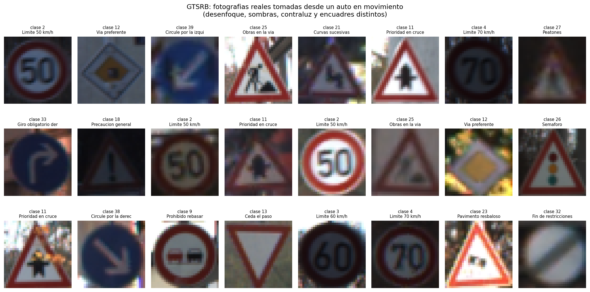
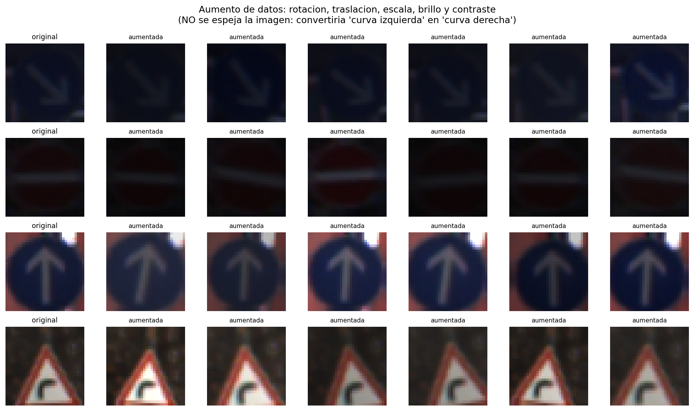
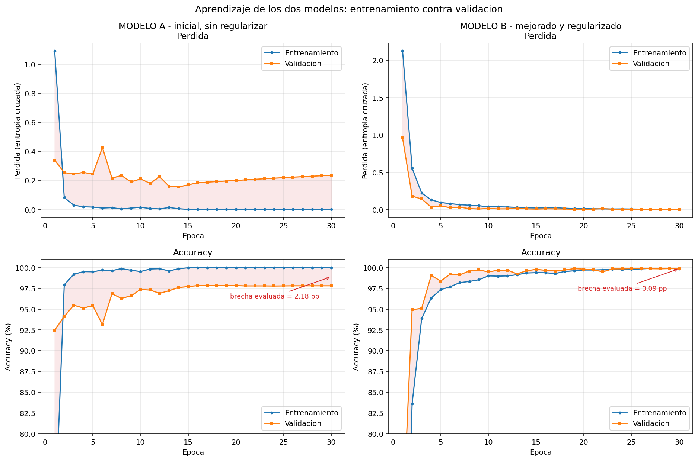
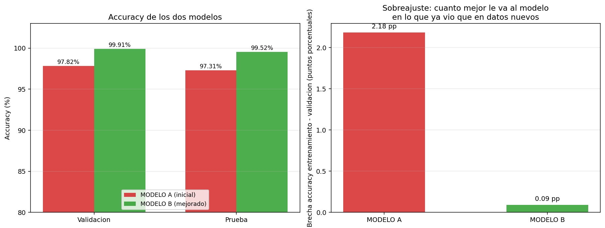
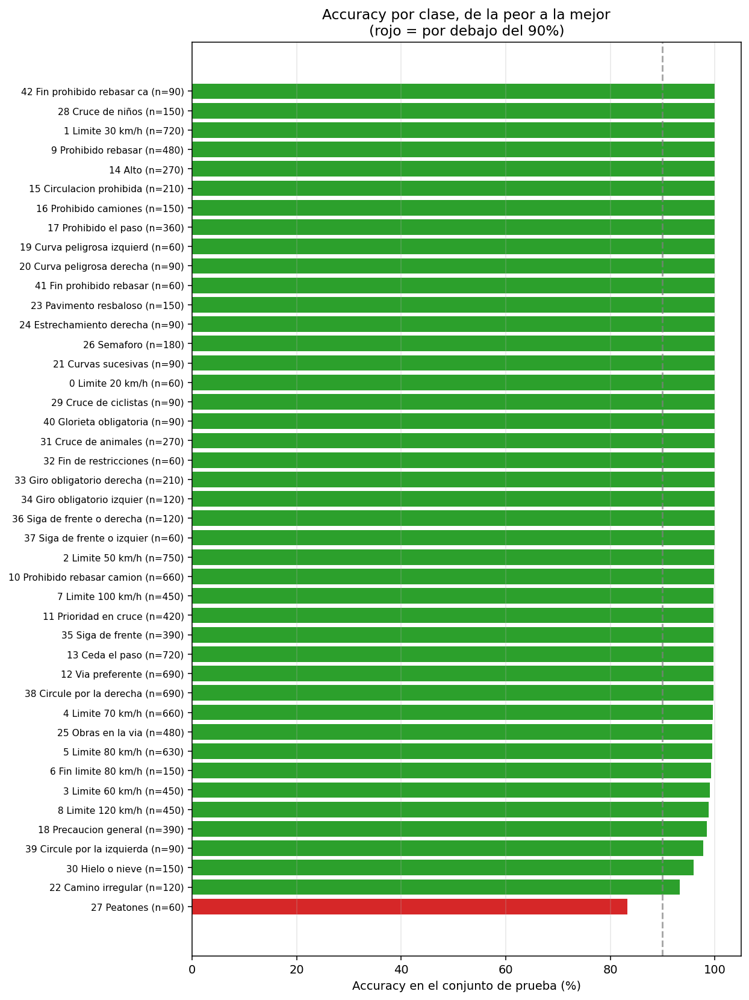
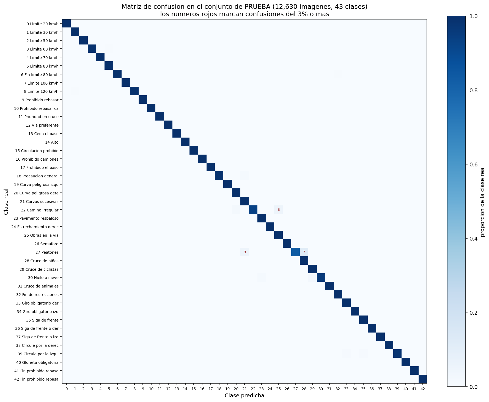
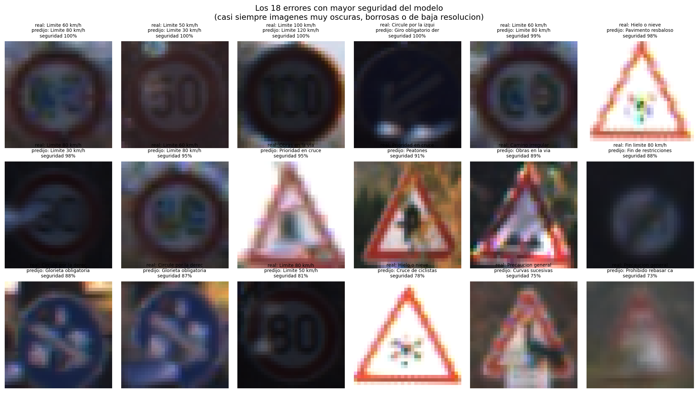

# Reconocimiento de señales de tránsito con una red neuronal convolucional

**Santiago Serrano Montalvo — A01751347**
Módulo 2 · Portafolio de Implementación · Implementación de un modelo de deep learning

---

## Resumen ejecutivo

| | MODELO A (inicial) | MODELO B (mejorado) | Cambio |
|---|---:|---:|---:|
| Parámetros entrenables | 2,185,291 | **309,771** | **7.1× menos** |
| Accuracy entrenamiento | 100.00 % | 100.00 % | — |
| Accuracy validación | 97.82 % | **99.91 %** | **+2.09 pp** |
| **Accuracy PRUEBA** | 97.31 % | **99.52 %** | **+2.22 pp** |
| **F1 macro PRUEBA** | 0.9602 | **0.9915** | **+0.0313** |
| Brecha entrenamiento−validación | 2.18 pp | **0.09 pp** | **−2.09 pp** |
| **Errores sobre 12,630 imágenes** | 340 | **60** | **82 % menos** |

El modelo final alcanza **99.52 % de accuracy sobre el conjunto de prueba oficial de GTSRB**, por encima del desempeño humano reportado en el benchmark original (98.84 %), usando 7 veces menos parámetros que la aproximación inicial.

---

## 1. El problema

Clasificar en cuál de **43 señales de tránsito** corresponde una fotografía tomada desde un vehículo en movimiento.

Es el problema de percepción más básico de un sistema de asistencia al conductor: si el vehículo no lee la señal, no puede avisar que el límite bajó a 30 ni que viene un alto. Es también un problema con un requisito de precisión inusualmente alto —confundir «límite 80» con «límite 30» tiene consecuencias reales— y con condiciones de captura hostiles: la cámara va en movimiento, la iluminación cambia constantemente y la señal puede aparecer a 15 píxeles de distancia o a 250.

---

## 2. El conjunto de datos: GTSRB

### 2.1 Qué es

**German Traffic Sign Recognition Benchmark.** Son fotografías **reales** capturadas por una cámara montada en un auto circulando por carreteras de Alemania. Fue publicado para la competencia IJCNN 2011 y sigue siendo el estándar de referencia para reconocimiento de señales.

| | |
|---|---|
| Imágenes de entrenamiento | 39,209 |
| Imágenes de prueba | 12,630 (conjunto oficial, etiquetas aparte) |
| Clases | 43 |
| Tamaño original | variable, de ~15×15 a ~250×250 píxeles |
| Formato | `.ppm` en color |

**No es un dataset sintético ni un ejemplo de clase.** Las imágenes traen desenfoque de movimiento, sombras duras, contraluz, lluvia, señales parcialmente tapadas y una variación enorme de tamaño según la distancia a la que se tomó la foto.



### 2.2 El detalle crítico: las pistas (*tracks*)

**Las imágenes de entrenamiento no son independientes entre sí.** Cada señal física fue fotografiada **30 veces seguidas** mientras el auto se le acercaba, y esas 30 fotos forman una *pista*. Se reconocen por el nombre del archivo:

```
00012_00007.ppm
^^^^^ pista     ^^^^^ cuadro dentro de la pista
```

Las 30 fotos de una misma pista son casi idénticas: la misma señal, el mismo poste, el mismo fondo, tomadas con fracciones de segundo de diferencia.

**Si la validación se separara al azar**, cuadros de la misma señal física caerían en entrenamiento y en validación al mismo tiempo. El modelo obtendría una puntuación inflada por reconocer una foto casi repetida, no por generalizar a señales que nunca vio.

Por eso **la separación se hace por pista completa**: una señal física está entera en entrenamiento o entera en validación, nunca repartida.

```
      pistas totales      : 1307
      pistas a validacion : 261  (20%)
      imagenes train      : 31380
      imagenes validacion : 7829
      NINGUNA señal fisica aparece en los dos conjuntos a la vez.
```

> Este es exactamente el mismo problema metodológico que se documentó en la entrega `M2_Analisis`, donde el 75 % de las filas de prueba compartían vehículo (VIN) con el entrenamiento. Allí se detectó después de los hechos; aquí se previno desde el diseño de la partición.

### 2.3 Los tres conjuntos

| Conjunto | Imágenes | Origen |
|---|---:|---|
| **Entrenamiento** | 31,380 | 1,046 pistas |
| **Validación** | 7,829 | 261 pistas distintas, ninguna compartida |
| **Prueba** | 12,630 | **conjunto oficial de GTSRB**, señales físicas completamente distintas |

El conjunto de prueba es el oficial del benchmark, lo que permite comparar el resultado con la literatura publicada.

### 2.4 Desbalance de clases

El dataset no está balanceado: refleja la frecuencia real con la que aparece cada señal en carretera.

| | Clase | Imágenes (train) |
|---|---|---:|
| Más frecuentes | Límite 50 km/h | 1,800 |
| | Límite 30 km/h | 1,770 |
| | Ceda el paso | 1,740 |
| Menos frecuentes | Límite 20 km/h | 180 |
| | Peatones | 180 |
| | Fin de restricciones | 180 |
| | Siga de frente o izquierda | 180 |

Una proporción de **10 a 1** entre la clase más y la menos representada. Por eso se reporta el **F1 macro** además del accuracy: promedia las 43 clases con el mismo peso y detecta si el modelo está abandonando las señales poco frecuentes.

### 2.5 Preprocesamiento

1. **Recorte a la región de interés.** El dataset incluye las coordenadas del rectángulo que contiene la señal. Recortar por ahí quita el fondo (asfalto, cielo, árboles) y hace que la señal ocupe siempre una porción parecida de la imagen.
2. **Redimensionado a 32×32 píxeles** en color, con interpolación bilineal.
3. **Normalización por canal** con la media y la desviación calculadas **sólo con el conjunto de entrenamiento**:

| Canal | Media | Desviación |
|---|---:|---:|
| R | 0.3190 | 0.2596 |
| G | 0.2871 | 0.2415 |
| B | 0.3061 | 0.2528 |

Las medias bajas (≈0.3 sobre 1.0) confirman que buena parte del dataset son imágenes oscuras.

---

## 3. Por qué una red convolucional

Una imagen de 32×32 en color tiene **3,072 números**. Una capa densa conectada a todos ellos tendría que aprender por separado que un borde rojo en la esquina superior izquierda significa lo mismo que un borde rojo en el centro.

La convolución resuelve esto con dos propiedades:

| Propiedad | Qué significa |
|---|---|
| **Pesos compartidos** | Un filtro de 3×3 se desliza por toda la imagen. Los mismos 9 pesos detectan el borde esté donde esté, así que el modelo aprende la forma **una sola vez** en lugar de una vez por posición. |
| **Localidad** | Cada neurona sólo mira una vecindad pequeña. Al apilar capas, el campo receptivo crece: la primera capa ve bordes, la segunda esquinas y arcos, la tercera la silueta completa del triángulo o del círculo. |

Esto es lo que hace que la arquitectura sea **profunda en el sentido útil**: la jerarquía de representaciones se construye sola, capa sobre capa, en lugar de tener que diseñarse a mano. Un perceptrón multicapa sobre los 3,072 píxeles crudos no tiene ninguna de las dos propiedades.

---

## 4. MODELO A — aproximación inicial

### 4.1 Arquitectura

```
entrada 3 x 32 x 32
  bloque 1:  Conv 3->32   ReLU   Conv 32->32   ReLU   MaxPool  -> 32 x 16 x 16
  bloque 2:  Conv 32->64  ReLU   Conv 64->64   ReLU   MaxPool  -> 64 x  8 x  8
  aplanado (4096)  ->  Densa 512  ReLU  ->  Densa 43
```

| | |
|---|---|
| Parámetros | **2,185,291** |
| Optimizador | Adam, tasa fija 1e-3 |
| Regularización | **ninguna** (sin BatchNorm, sin Dropout, sin weight decay) |
| Aumento de datos | **no** |
| Épocas | 30 |

Es deliberadamente la versión ingenua: la arquitectura que saldría de aplicar la receta básica sin pensar en generalización. Sirve como punto de partida y, sobre todo, para que el problema se manifieste con claridad.

### 4.2 Qué pasó durante el entrenamiento

| Época | Pérdida train | Acc train | Pérdida val | Acc val |
|---:|---:|---:|---:|---:|
| 1 | 1.0912 | 68.39 % | 0.3397 | 92.49 % |
| 3 | 0.0296 | 99.21 % | 0.2444 | 95.48 % |
| 7 | 0.0125 | 99.65 % | 0.2162 | 96.85 % |
| 10 | 0.0147 | 99.54 % | 0.2103 | 97.37 % |
| **14** | 0.0053 | 99.88 % | **0.1555** | 97.61 % |
| 16 | **0.0000** | **100.00 %** | 0.1843 | 97.84 % |
| 20 | 0.0000 | 100.00 % | 0.1999 | 97.84 % |
| 25 | 0.0000 | 100.00 % | 0.2189 | 97.80 % |
| 30 | 0.0000 | 100.00 % | **0.2358** | 97.82 % |

**La firma del sobreajuste está en la columna de pérdida de validación, no en la de accuracy.**

A partir de la época 16 la pérdida de entrenamiento es exactamente **0.0000**: el modelo ha memorizado las 31,380 imágenes. Desde ese punto:

- La **accuracy** de validación se queda congelada en 97.8 %. Visto sólo con esta columna, parecería que el entrenamiento simplemente convergió.
- La **pérdida** de validación **sube de forma sostenida**, de 0.1555 en la época 14 a 0.2358 en la 30, un aumento del 52 %.

Esas dos cosas juntas significan que el modelo **sigue cambiando** después de haber memorizado, y que cada cambio lo vuelve **más confiado en sus errores**. Acierta el mismo número de casos, pero cuando se equivoca lo hace con más seguridad. En un sistema real esto es peor que un error dudoso, porque destruye la utilidad del nivel de confianza como criterio para pedir revisión humana.

### 4.3 Resultados

| Conjunto | Accuracy | F1 macro |
|---|---:|---:|
| Entrenamiento | 100.00 % | 1.0000 |
| Validación | 97.82 % | 0.9660 |
| **Prueba** | **97.31 %** | **0.9602** |

**Brecha entrenamiento − validación: 2.18 puntos porcentuales.**

El modelo alcanza el 100 % en lo que ya vio y baja a 97.82 % en datos nuevos. **340 errores** sobre las 12,630 imágenes de prueba. No es un mal resultado en términos absolutos, pero la pérdida de validación creciente indica que hay margen claro de mejora.

---

## 5. MODELO B — versión mejorada

### 5.1 Los ocho cambios y qué problema ataca cada uno

| # | Cambio | Problema que ataca | Por qué funciona |
|---|---|---|---|
| 1 | **BatchNorm** tras cada convolución | entrenamiento inestable | Normaliza las activaciones de cada lote. Permite una tasa de aprendizaje más alta y agrega un ruido leve que por sí mismo ya regulariza. |
| 2 | **Dropout creciente** 0.2 / 0.3 / 0.4 / 0.5 | memorización | Apaga neuronas al azar, así ninguna se vuelve indispensable. Poco al principio (las primeras capas detectan bordes, que siempre hacen falta) y mucho al final, que es donde se memoriza. |
| 3 | **Tercer bloque convolucional** (32→64→128) | campo receptivo insuficiente | Deja que la red arme la silueta completa de la señal, no sólo sus bordes. |
| 4 | **Global Average Pooling** en vez de aplanar | exceso de parámetros densos | Aplanar 64×8×8 hacia una densa de 512 costaba **2.1 M de pesos**, casi todos los del MODELO A, y es justo donde ocurre la memorización. Promediar cada mapa deja 128 números. |
| 5 | **Aumento de datos** | poca variedad de ejemplos | Ver §5.2. |
| 6 | **Weight decay 1e-4** | pesos grandes | Penalización L2 que empuja los pesos hacia cero y limita cuánto puede especializarse la red. |
| 7 | **Decaimiento coseno** de la tasa | oscilación al final | Al principio conviene avanzar rápido; al final, afinar con pasos chicos para asentarse en el mínimo. |
| 8 | **Early stopping** (paciencia 8) | entrenar de más | Guarda los pesos de la mejor época en validación y corta si deja de mejorar. |

El cambio 4 merece énfasis: **el MODELO B tiene 7.1 veces menos parámetros que el MODELO A** (309,771 contra 2,185,291) y aun así generaliza mucho mejor. La capacidad que se eliminó era precisamente la que se estaba usando para memorizar.

### 5.2 Arquitectura resultante

```
entrada 3 x 32 x 32
  bloque 1:  [Conv 3->32   + BN + ReLU] x2   MaxPool   Dropout(0.2)  -> 32 x 16 x 16
  bloque 2:  [Conv 32->64  + BN + ReLU] x2   MaxPool   Dropout(0.3)  -> 64 x  8 x  8
  bloque 3:  [Conv 64->128 + BN + ReLU] x2   MaxPool   Dropout(0.4)  -> 128 x 4 x 4
  GlobalAvgPool (128)  ->  Densa 128  BN  ReLU  Dropout(0.5)  ->  Densa 43
```

### 5.3 El aumento de datos, y el error que no se cometió



**Qué se hace y por qué:**

| Transformación | Qué reproduce de la realidad |
|---|---|
| Rotación ±12° | el poste puede estar ligeramente inclinado |
| Traslación ±10 % | la señal aparece descentrada en el encuadre |
| Escala 0.9 – 1.1 | el auto se acerca a la señal |
| Brillo ±30 % | sol de frente, sombra de un árbol, túnel, día nublado |
| Contraste ±30 % | igual que el anterior |

**Qué NO se hace y por qué:**

> **No se espeja la imagen horizontalmente.** El *horizontal flip* es el aumento por defecto en prácticamente cualquier problema de visión, y aquí sería un **error grave**.
>
> Espejar «curva peligrosa a la izquierda» produce **exactamente** la señal de «curva peligrosa a la derecha», que es **otra clase del dataset**. Lo mismo ocurre con:
>
> - giro obligatorio derecha ↔ giro obligatorio izquierda
> - circule por la derecha ↔ circule por la izquierda
> - siga de frente o derecha ↔ siga de frente o izquierda
>
> Aplicarlo entrenaría al modelo con **etiquetas equivocadas** en 6 de las 43 clases.

Este es el punto donde el conocimiento del problema manda sobre la receta genérica. Es también el tipo de error que no produce un mensaje de error: el programa correría perfectamente y el modelo simplemente aprendería mal.

El aumento se aplica **sólo en entrenamiento**. Validación y prueba se miden siempre sobre la imagen original, sin alterar.

### 5.4 Qué pasó durante el entrenamiento

| Época | Pérdida train | Acc train | Pérdida val | Acc val | Tasa |
|---:|---:|---:|---:|---:|---:|
| 1 | 2.1240 | 38.94 % | 0.9586 | 68.43 % | 0.00200 |
| 4 | 0.1325 | 96.35 % | 0.0355 | 99.05 % | 0.00195 |
| 9 | 0.0529 | 98.54 % | 0.0095 | 99.73 % | 0.00167 |
| 15 | 0.0235 | 99.40 % | 0.0080 | 99.80 % | 0.00110 |
| 19 | 0.0158 | 99.63 % | 0.0056 | 99.89 % | 0.00069 |
| **26** | 0.0075 | 99.85 % | **0.0030** | **99.91 %** | 0.00013 |
| 30 | 0.0063 | 99.88 % | 0.0035 | 99.87 % | 0.00001 |

**Tres diferencias con el MODELO A saltan a la vista:**

1. **Arranca más lento.** En la época 1 va en 38.94 % contra el 68.39 % del MODELO A. El dropout y el aumento de datos hacen la tarea deliberadamente más difícil.
2. **La pérdida de validación BAJA en lugar de subir.** Termina en 0.0035, **67 veces menor** que los 0.2358 del MODELO A. El modelo no sólo acierta más: está genuinamente más seguro de sus aciertos.
3. **La pérdida de entrenamiento nunca llega a cero.** Se queda en 0.0063. Con dropout activo y cada imagen transformada de forma distinta en cada época, el modelo **no puede** memorizar el conjunto: cada época ve datos que técnicamente nunca había visto.

**Sobre el early stopping:** no llegó a dispararse —la mejor época fue la 26 y se corrieron las 30, menos que la paciencia de 8. Pero **sí actuó su otra función**: el modelo final son los pesos de la época 26 (99.91 % de validación), no los de la época 30 (99.87 %). Sin esa restauración se habrían conservado unos pesos ligeramente peores.

### 5.5 Curvas de aprendizaje de los dos modelos



La comparación visual resume todo el trabajo. En el panel del MODELO A (izquierda), las dos curvas de pérdida **divergen**: la de entrenamiento cae a cero y la de validación empieza a subir. En el del MODELO B (derecha), las dos curvas **bajan juntas** y se mantienen pegadas hasta el final. La zona roja sombreada —que es la brecha— es visiblemente más delgada.

> **Nota sobre las dos formas de medir la brecha.** Durante el entrenamiento, la accuracy de entrenamiento del MODELO B se mide con el dropout activo y sobre imágenes aumentadas, así que en la época 30 marca 99.88 % y la brecha contra validación parece de 0.01 pp. La cifra que se reporta en este documento (**0.09 pp**) es la de la **evaluación final**: el modelo puesto en modo `eval()` —dropout apagado, BatchNorm fijo— y medido sobre las imágenes de entrenamiento **sin aumentar**, que da 100.00 %. Es la medición correcta para diagnosticar el ajuste, porque compara peras con peras: ambos conjuntos evaluados en las mismas condiciones. Las gráficas anotan esta segunda cifra.

---

## 6. Resultados finales

### 6.1 Comparación de los dos modelos



| | MODELO A | MODELO B | Cambio |
|---|---:|---:|---:|
| Parámetros entrenables | 2,185,291 | 309,771 | **7.1× menos** |
| Accuracy entrenamiento | 100.00 % | 100.00 % | +0.00 |
| Accuracy validación | 97.82 % | **99.91 %** | **+2.09 pp** |
| **Accuracy PRUEBA** | 97.31 % | **99.52 %** | **+2.22 pp** |
| **F1 macro PRUEBA** | 0.9602 | **0.9915** | **+0.0313** |
| Brecha train − val | 2.18 pp | **0.09 pp** | **−2.09 pp** |
| Pérdida de validación final | 0.2358 | **0.0035** | **67× menor** |

**Sobre las 12,630 imágenes de prueba, los errores pasan de 340 a 60: una reducción del 82 %.**

Mejorar del 97.31 % al 99.52 % suena a poco visto como porcentaje, pero es la diferencia entre **un error cada 37 señales** y **un error cada 210 señales**. En un sistema de asistencia al conductor que procesa miles de señales por trayecto, es una diferencia de naturaleza, no de grado.

### 6.2 Diagnóstico del ajuste

| | MODELO A | MODELO B |
|---|---|---|
| **Sesgo** | BAJO (100 % en entrenamiento) | BAJO (100 % en entrenamiento) |
| **Varianza** | MEDIA — brecha 2.18 pp y **pérdida de validación creciente** | **BAJA** — brecha 0.09 pp |
| **Ajuste** | **OVERFITTING** | **FITTING** |

El MODELO B cumple las dos condiciones del buen ajuste: error de entrenamiento bajo (sesgo bajo) **y** brecha prácticamente nula (varianza baja).

### 6.3 Por qué validación (99.91 %) supera a prueba (99.52 %)

No es un error de medición ni una contradicción, y vale la pena explicarlo.

Las pistas de validación, aunque corresponden a señales físicas distintas de las de entrenamiento, **provienen de las mismas sesiones de grabación**: las mismas carreteras, las mismas cámaras, condiciones de luz parecidas. El conjunto de prueba oficial de GTSRB se capturó de forma separada.

La diferencia de **0.39 puntos** es precisamente el costo de cambiar de condiciones de captura. Es una brecha pequeña, lo que indica que el modelo generaliza bien más allá de la sesión concreta en que se tomaron las fotos, pero su existencia es un recordatorio de que **incluso una partición cuidadosa por pista sigue siendo optimista** frente a un conjunto verdaderamente independiente.

### 6.4 Desempeño por clase



```
                 macro avg      0.992     0.991     0.991     12630
              weighted avg      0.995     0.995     0.995     12630
```

El F1 macro (0.991) y el ponderado (0.995) están muy cerca, lo que confirma que el modelo **no abandonó las clases minoritarias** pese al desbalance de 10 a 1.

Las clases con menor F1:

| Clase | Precisión | Recall | F1 | n |
|---|---:|---:|---:|---:|
| Peatones | 0.962 | **0.833** | **0.893** | 60 |
| Curvas sucesivas | 0.918 | 1.000 | 0.957 | 90 |
| Camino irregular | 1.000 | 0.933 | 0.966 | 120 |
| Cruce de niños | 0.955 | 1.000 | 0.977 | 150 |
| Cruce de ciclistas | 0.957 | 1.000 | 0.978 | 90 |
| Hielo o nieve | 1.000 | 0.960 | 0.980 | 150 |

**Todas las clases problemáticas son señales triangulares de advertencia** con un pictograma pequeño en el centro. A 32×32 píxeles, la diferencia entre la silueta de un peatón, un niño y un ciclista se reduce a unos pocos píxeles. La forma triangular y el borde rojo se reconocen perfectamente; lo que se pierde es el detalle interior.

Que la peor clase sea «Peatones» con apenas 60 casos de prueba y 180 de entrenamiento combina los dos factores: **poca resolución y pocos ejemplos**.

### 6.5 Matriz de confusión



La matriz es prácticamente diagonal. Las pocas confusiones visibles se concentran en el bloque de señales triangulares de advertencia, que es coherente con el análisis anterior.

### 6.6 Los errores del modelo



Estos son los 18 errores en los que el modelo estuvo **más seguro** de su respuesta equivocada. Casi todos son imágenes que resultan difíciles también para una persona: fotos muy oscuras, con desenfoque de movimiento severo, o de resolución original tan baja que al escalar a 32×32 el pictograma interior se pierde.

Es una señal de salud del modelo: sus errores más confiados ocurren donde la información realmente no está en la imagen, no en casos que deberían ser fáciles.

---

## 7. Predicciones desde la consola

El modelo entrenado se guarda en `modelo_gtsrb.pt` (1.3 MB) y `predecir.py` lo usa sin volver a entrenar nada.

```
python3 predecir.py                  # 10 imágenes al azar del conjunto de prueba
python3 predecir.py --cuantas 25     # 25 imágenes
python3 predecir.py --imagen foto.jpg  # una fotografía propia
python3 predecir.py --dudosas        # las predicciones MENOS seguras del modelo
```

Salida real:

```
============================================================================
 CLASIFICADOR DE SEÑALES DE TRANSITO
============================================================================
 Modelo    : CNN entrenada sobre GTSRB (43 clases)
 Dispositivo: mps
 Accuracy del modelo en el conjunto de prueba: 99.52%

 --------------------------------------------------------------------------
 Imagen 1
   clase real : 25  Obras en la via
   PREDICCION : 25  Obras en la via   CORRECTO
   las 3 clases mas probables:
     1. Obras en la via               81.67%  ################################
     2. Estrechamiento derecha         4.11%  #
     3. Limite 60 km/h                 3.78%  #

 --------------------------------------------------------------------------
 Imagen 3
   clase real :  9  Prohibido rebasar
   PREDICCION :  9  Prohibido rebasar   CORRECTO
   las 3 clases mas probables:
     1. Prohibido rebasar             92.30%  ####################################
     2. Prohibido camiones             3.79%  #
     3. Prohibido rebasar camiones     3.13%  #
```

Además de la clase predicha se muestran **las tres clases más probables con su porcentaje**, que es la salida del `softmax`. Obsérvese que las alternativas que el modelo considera son siempre señales visualmente parecidas («prohibido rebasar» compite con «prohibido rebasar camiones»), lo cual indica que la representación aprendida es coherente.

El modo `--dudosas` clasifica las 12,630 imágenes y muestra aquellas donde la confianza fue más baja. En un sistema real serían las que conviene enviar a revisión en lugar de decidir automáticamente.

---

## 8. Detalles de implementación

| | |
|---|---|
| Framework | **PyTorch 2.14** |
| Dispositivo | GPU integrada de Apple (MPS), con respaldo automático a CUDA o CPU |
| Función de pérdida | entropía cruzada (`CrossEntropyLoss`) |
| Optimizador | Adam |
| Tamaño de lote | 128 |
| Semilla | 42 (resultados reproducibles) |
| Tiempo MODELO A | ~5.6 s por época × 30 = **2.8 min** |
| Tiempo MODELO B | ~20 s por época × 30 = **10 min** |

El MODELO B tarda 3.5 veces más por época pese a tener 7 veces menos parámetros, porque el aumento de datos se aplica imagen por imagen en Python y ese paso —no el cálculo de la red— es el cuello de botella.

**Archivos:**

| Archivo | Qué hace |
|---|---|
| `preparar_datos.py` | descarga los ZIP oficiales, descomprime, recorta, redimensiona y separa por pista |
| `main.py` | entrena y evalúa los dos modelos, genera las figuras y guarda el modelo |
| `predecir.py` | predicciones desde la consola con el modelo guardado |
| `modelo_gtsrb.pt` | pesos entrenados (1.3 MB) |
| `historial.json` | métricas época por época de ambos modelos |

---

## 9. Conclusiones

1. **Se entrenó una arquitectura profunda con un framework.** Una CNN de 6 capas convolucionales organizadas en 3 bloques, implementada en PyTorch, con BatchNorm, Dropout y Global Average Pooling. No es un perceptrón multicapa: la jerarquía de características se construye por convolución.

2. **Se usó un conjunto de datos reales.** GTSRB son fotografías capturadas desde un vehículo en carreteras de Alemania, con las condiciones adversas propias del mundo real. El conjunto de prueba es el oficial del benchmark, lo que hace el resultado comparable con la literatura.

3. **Se evaluó la aproximación inicial y se hicieron ajustes que mejoraron el desempeño.** El MODELO A alcanzó 97.31 % en prueba con una brecha de 2.18 pp y una pérdida de validación que **crecía** con las épocas. Ocho cambios documentados llevaron al MODELO B a **99.52 %** con una brecha de **0.09 pp** y una pérdida de validación 67 veces menor.

4. **Los errores bajaron de 340 a 60 sobre 12,630 imágenes: un 82 % menos**, usando **7.1 veces menos parámetros**. El resultado supera el desempeño humano reportado en el benchmark original (98.84 %).

5. **La mejora está explicada, no es casual.** El cambio individual de mayor impacto fue sustituir la capa densa de 512 neuronas por Global Average Pooling: eliminó 1.9 millones de parámetros que eran exactamente los que se estaban usando para memorizar. El aumento de datos y el dropout impidieron que la pérdida de entrenamiento llegara a cero, que era la señal de memorización del MODELO A.

6. **La partición se diseñó para evitar una fuga de datos sutil.** Separar por pista completa en lugar de al azar impidió que cuadros casi idénticos de la misma señal física quedaran a ambos lados. Es el mismo problema que se documentó con los VIN repetidos en `M2_Analisis`, prevenido aquí desde el diseño.

7. **El límite que queda es de resolución.** Las seis clases con menor F1 son todas señales triangulares de advertencia cuyo pictograma interior se pierde a 32×32 píxeles. Es una limitación del preprocesamiento elegido, no del modelo.

### Mejoras posibles

| Prioridad | Acción | Efecto esperado |
|---|---|---|
| 1 | Subir la resolución a 48×48 o 64×64 | atacaría directamente el error dominante (pictogramas de las triangulares) |
| 2 | Aumentar más las clases minoritarias | «Peatones» tiene 180 ejemplos contra 1,800 de «Límite 50» |
| 3 | Ensamble de varias CNN con semillas distintas | es lo que usó la entrada ganadora de la competencia IJCNN 2011 |
| 4 | *Spatial Transformer Network* | aprendería a enderezar la señal antes de clasificarla |

---

## Anexo: cómo reproducir estos resultados

```
cd M2_DeepLearning

python3 preparar_datos.py    # descarga GTSRB y arma datos/gtsrb_32.npz
python3 main.py              # entrena los dos modelos (~15 min)
python3 predecir.py          # predicciones desde la consola
```

`preparar_datos.py` sólo hace falta la primera vez; `main.py` lo invoca automáticamente si el archivo no existe. El dataset ocupa ≈1 GB y **no está versionado** en el repositorio.

Para una corrida corta de prueba: `python3 main.py --epocas 5`.

Requisitos: `torch`, `numpy`, `matplotlib`, `pillow`, `scikit-learn`. La salida completa de consola está guardada en `salida.txt`.
