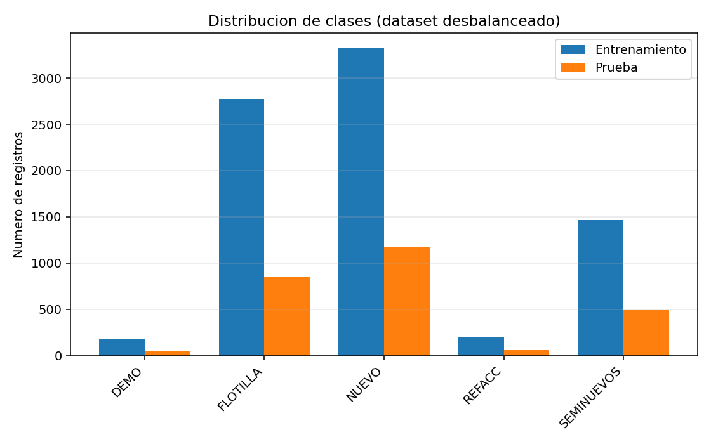
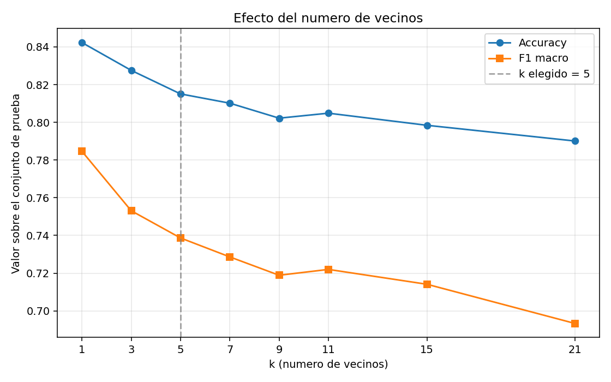
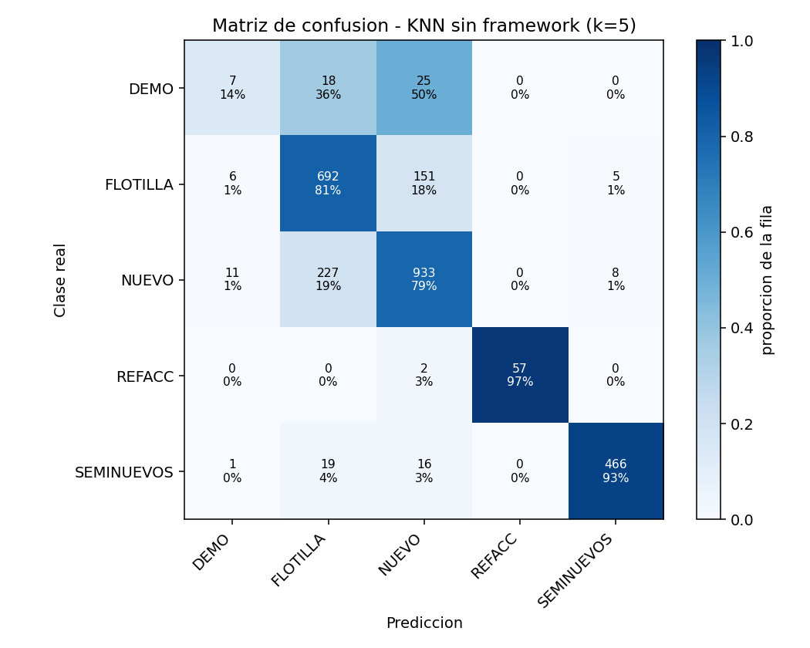
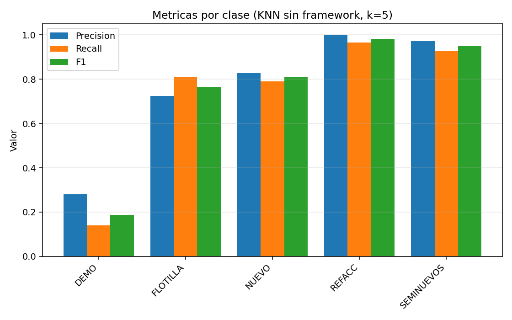

# Clasificación del tipo de garantía de un crédito automotriz con KNN implementado desde cero

**Santiago Serrano Montalvo — A01751347**
Módulo 2 · Portafolio de Implementación · Implementación de una técnica de aprendizaje máquina **sin** framework

---

## 1. Introducción y objetivo

Este trabajo implementa el algoritmo **K-Nearest Neighbors (KNN)** completamente desde cero, sin usar ninguna biblioteca de aprendizaje máquina ni de estadística avanzada. El objetivo es clasificar el **tipo de garantía** (`collateral`) que respalda un crédito automotriz a partir de la información financiera del pago mensual.

El programa está en un único archivo `main.py` que se ejecuta directamente desde la consola:

```
python3 main.py
```

**Qué se programó a mano:** la media y la desviación estándar, la estandarización z-score, la distancia euclidiana, la búsqueda de vecinos, la votación por mayoría, la matriz de confusión, el accuracy, la precisión, el recall y el F1.

**Qué se importó:** únicamente `csv`, `math`, `os` y `random` de la librería estándar de Python, más `matplotlib` que se usa **solo** para dibujar las gráficas de resultados, no para ningún cálculo del algoritmo.

---

## 2. Cómo funciona el algoritmo

KNN es un algoritmo de clasificación llamado *perezoso* (*lazy learner*): no ajusta parámetros durante el entrenamiento, simplemente memoriza los datos. Todo el trabajo ocurre al momento de predecir.

### 2.1 El procedimiento

1. Se recibe un punto nuevo **x** que se quiere clasificar.
2. Se mide la distancia de **x** a **cada uno** de los puntos de entrenamiento.
3. Se ordenan esas distancias de menor a mayor.
4. Se toman los **k** puntos más cercanos, llamados *vecinos*.
5. Cada vecino emite **un voto** por su propia clase.
6. La clase con más votos es la predicción.

### 2.2 La distancia euclidiana

La cercanía entre dos créditos se mide con la distancia euclidiana, que es la generalización del teorema de Pitágoras a *n* dimensiones:

$$
d(a, b) = \sqrt{\sum_{i=1}^{n} (a_i - b_i)^2}
$$

En el código esto es un ciclo simple que acumula las diferencias al cuadrado y devuelve la raíz:

```python
def distancia_euclidiana(a, b):
    suma = 0.0
    for i in range(len(a)):
        diferencia = a[i] - b[i]
        suma += diferencia * diferencia
    return math.sqrt(suma)
```

### 2.3 La votación

Cada uno de los *k* vecinos aporta exactamente un voto a su clase. En caso de empate gana la clase que aparece antes en la lista ordenada, es decir **la del vecino más cercano**, que es el criterio de desempate habitual en KNN.

```python
def votar(clases_vecinas):
    votos = {}
    for clase in clases_vecinas:
        votos[clase] = votos.get(clase, 0) + 1

    mejor_clase, mayor_votos = None, -1
    for clase in clases_vecinas:      # se recorre en orden de cercanía
        if votos[clase] > mayor_votos:
            mayor_votos, mejor_clase = votos[clase], clase
    return mejor_clase
```

### 2.4 Por qué se eligió KNN

Es un algoritmo que **no supone ninguna forma para la frontera de decisión**. No asume que las clases se separen con una recta ni con una curva concreta: la frontera la dibujan los propios datos. Para un problema donde no se sabe de antemano cómo se relacionan el monto del crédito y el tipo de garantía, esa flexibilidad es una ventaja. Además su lógica es lo bastante directa como para programarla completa sin librerías, que es justo lo que pide la actividad.

---

## 3. El conjunto de datos

### 3.1 Origen y contenido

El archivo es `interest_ledger.csv`, un libro mayor de intereses de una financiera automotriz. Cada fila es el **pago mensual de un vehículo** en un mes concreto.

| Característica | Valor |
|---|---|
| Registros totales | 10,576 |
| Periodo | enero 2025 – marzo 2026 (15 meses) |
| Vehículos distintos (VIN) | 4,092 |
| Modelos distintos | 108 |
| Variable objetivo | `collateral` (tipo de garantía) |
| Número de clases | 5 |

### 3.2 Variables usadas para predecir

De las columnas crudas se derivan cinco variables:

| Variable | Cómo se obtiene | Qué representa |
|---|---|---|
| `principal` | columna `principal_amount` | saldo del crédito |
| `interes` | columna `interest_amount` | interés generado en el mes |
| `tasa` | `interes / principal` | qué tan caro sale cada peso prestado |
| `antiguedad` | `año del pago − year_model` | años que tenía el vehículo al pagar |
| `mes` | mes de `month_date` | estacionalidad |

Las dos variables derivadas (`tasa` y `antiguedad`) son las que más información aportan: `tasa` normaliza el interés respecto al tamaño del crédito, y `antiguedad` distingue directamente un vehículo del año de uno con varios años de uso.

### 3.3 Distribución de las clases

El dataset está **fuertemente desbalanceado**, lo cual condiciona todo el análisis posterior:

| Clase | Registros | Porcentaje | Entrenamiento | Prueba |
|---|---:|---:|---:|---:|
| NUEVO | 4,498 | 42.5 % | 3,319 | 1,179 |
| FLOTILLA | 3,625 | 34.3 % | 2,771 | 854 |
| SEMINUEVOS | 1,965 | 18.6 % | 1,463 | 502 |
| REFACC | 259 | 2.4 % | 200 | 59 |
| DEMO | 229 | 2.2 % | 179 | 50 |

La clase mayoritaria tiene **casi 20 veces** más ejemplos que la minoritaria.



### 3.4 Partición entrenamiento / prueba

| Conjunto | Registros | Porcentaje |
|---|---:|---:|
| **Entrenamiento** | 7,932 | 75 % |
| **Prueba** | 2,644 | 25 % |

La partición se hace barajando los **índices** con `random.seed(42)` fija, de modo que el resultado es exactamente reproducible en cada ejecución. Se barajan los índices y no las listas para que las variables `X` y las etiquetas `y` sigan emparejadas.

---

## 4. Normalización

KNN se basa en distancias, así que una variable con números grandes domina el cálculo. En este dataset el problema es severo:

| Variable | Media | Desviación estándar |
|---|---:|---:|
| `principal` | 372,502.30 | 157,576.43 |
| `interes` | 1,898.36 | 1,887.82 |
| `tasa` | 0.0049 | 0.0037 |
| `antiguedad` | 0.7959 | 1.4276 |
| `mes` | 5.6130 | 3.5193 |

Sin normalizar, la diferencia típica en `principal` es de cientos de miles y la de `tasa` es de milésimas. **La distancia euclidiana sería prácticamente sólo el monto del crédito** y las otras cuatro variables no influirían en nada.

Se aplica estandarización **z-score**:

$$
z = \frac{x - \mu}{\sigma}
$$

Así cada variable queda con media 0 y desviación 1, y todas pesan lo mismo en la distancia.

> **Detalle importante:** la media y la desviación se calculan **únicamente con el conjunto de entrenamiento** y después se aplican tal cual al conjunto de prueba. Si se calcularan con el dataset completo habría *fuga de información* (*data leakage*): el modelo estaría usando información del conjunto de prueba antes de ser evaluado en él, y el resultado dejaría de ser una estimación honesta.

---

## 5. Verificación de que la implementación es correcta

Antes de confiar en los resultados sobre el dataset real, el programa ejecuta **siete pruebas automáticas** sobre casos pequeños resueltos a mano. Si alguna falla el programa se detiene con un error. Esta es la evidencia de que cada pieza del algoritmo hace lo que debe:

| # | Qué verifica | Caso de prueba | Resultado esperado | Resultado obtenido |
|---|---|---|---|---|
| 1 | Distancia euclidiana | `d([0,0], [3,4])` — triángulo 3-4-5 | 5.0 | ✅ 5.0 |
| 2 | Media y desviación | datos `2,4,4,4,5,5,7,9` | media 5.0, desv. 2.0 | ✅ 5.0 y 2.0 |
| 3 | Votación por mayoría | `['A','B','B','A','B']` | `'B'` (3 votos contra 2) | ✅ `'B'` |
| 4 | Criterio de desempate | `['A','B','B','A']` | `'A'` (empate → vecino más cercano) | ✅ `'A'` |
| 5 | KNN completo | dos grupos separados en la recta | `0.9 → ROJO`, `11.2 → AZUL` | ✅ correcto |
| 6 | Memorización con k=1 | predecir el propio entrenamiento | accuracy 100 % | ✅ 100 % |
| 7 | Matriz y métricas | real `A A A B B`, predicho `A A B B B` | matriz `[[2,1],[0,2]]`, F1(A)=0.800 | ✅ coincide |

La prueba 3 es la más relevante: verifica que la votación cuenta **clases** y no pares `(distancia, clase)`, que es el error más fácil de cometer al implementar este paso y que convertiría silenciosamente el modelo en un 1-NN.

La prueba 6 comprueba la propiedad definitoria de KNN: con `k=1`, el vecino más cercano de un punto del entrenamiento es él mismo, por lo que debe reproducir su propio entrenamiento perfectamente.

Salida real del programa:

```
==============================================================================
 PRUEBAS DE CORRECTITUD DE LA IMPLEMENTACION
==============================================================================
 [OK] distancia_euclidiana([0,0],[3,4]) = 5.0  (esperado 5.0)
 [OK] media = 5.0 y desviacion = 2.0  (esperado 5.0 y 2.0)
 [OK] votar(['A','B','B','A','B']) = 'B'  (esperado 'B')
 [OK] votar(['A','B','B','A']) = 'A'  (empate, gana el mas cercano)
 [OK] KNN de juguete: 0.9 -> ROJO y 11.2 -> AZUL  (grupos separados)
 [OK] k=1 reproduce el 100% del entrenamiento  (memorizacion)
 [OK] matriz de confusion = [[2,1],[0,2]] y F1(A) = 0.800  (esperado 0.800)

 Las 7 pruebas pasaron: el algoritmo esta implementado correctamente.
```

---

## 6. Elección del número de vecinos

Se evaluaron ocho valores de *k* sobre el conjunto de prueba. Para no repetir el cálculo completo ocho veces, el programa guarda de una sola vez la lista ordenada de los 21 vecinos más cercanos de cada punto y luego sólo repite la votación, que es instantánea.

| k | Accuracy | F1 macro |
|---:|---:|---:|
| 1 | 84.23 % | 0.785 |
| 3 | 82.75 % | 0.753 |
| **5** | **81.51 %** | **0.739** |
| 7 | 81.01 % | 0.729 |
| 9 | 80.22 % | 0.719 |
| 11 | 80.48 % | 0.722 |
| 15 | 79.84 % | 0.714 |
| 21 | 79.01 % | 0.693 |



**Lectura del resultado.** El accuracy baja de forma monótona conforme crece *k*. Esto **no** significa que `k=1` sea el mejor modelo: significa que el dataset contiene muchos registros casi idénticos. El mismo vehículo (mismo VIN) aparece en varios meses con montos muy parecidos, así que el vecino más cercano de un registro de prueba suele ser **otro pago del mismo coche**. Con `k=1` el modelo está reconociendo vehículos, no aprendiendo la regla general.

Se eligió **k = 5** porque obliga a que la decisión se apoye en cinco puntos distintos en lugar de en una sola coincidencia, a cambio de 2.7 puntos de accuracy. Es una decisión consciente de preferir un modelo que generalice sobre uno que memorice.

---

## 7. Resultados

### 7.1 Métrica global

| Métrica | Valor |
|---|---:|
| **Accuracy** | **81.51 %** |
| **F1 macro** | **0.739** |
| Línea base (clase mayoritaria) | 42.55 % |

El modelo clasifica correctamente unos 81 de cada 100 créditos del conjunto de prueba, **casi el doble** de lo que lograría un clasificador trivial que siempre respondiera «NUEVO».

### 7.2 Matriz de confusión

Las filas son la clase real y las columnas la predicción. La diagonal son los aciertos.

| Real ↓ / Predicho → | DEMO | FLOTILLA | NUEVO | REFACC | SEMINUEVOS |
|---|---:|---:|---:|---:|---:|
| **DEMO** | **7** | 18 | 25 | 0 | 0 |
| **FLOTILLA** | 6 | **692** | 151 | 0 | 5 |
| **NUEVO** | 11 | 227 | **933** | 0 | 8 |
| **REFACC** | 0 | 0 | 2 | **57** | 0 |
| **SEMINUEVOS** | 1 | 19 | 16 | 0 | **466** |



### 7.3 Métricas por clase

Dado el desbalance, el accuracy global no basta. Se calculan precisión, recall y F1 de cada clase por separado:

$$
\text{precisión} = \frac{TP}{TP+FP} \qquad
\text{recall} = \frac{TP}{TP+FN} \qquad
F_1 = \frac{2 \cdot \text{precisión} \cdot \text{recall}}{\text{precisión} + \text{recall}}
$$

| Clase | Precisión | Recall | F1 | n (prueba) |
|---|---:|---:|---:|---:|
| DEMO | 0.280 | 0.140 | 0.187 | 50 |
| FLOTILLA | 0.724 | 0.810 | 0.765 | 854 |
| NUEVO | 0.828 | 0.791 | 0.809 | 1,179 |
| REFACC | 1.000 | 0.966 | 0.983 | 59 |
| SEMINUEVOS | 0.973 | 0.928 | 0.950 | 502 |
| **Macro promedio** | **0.761** | **0.727** | **0.739** | |



### 7.4 Por qué se reportan estas métricas y no sólo el accuracy

La clase DEMO tiene apenas 50 casos en el conjunto de prueba, un 1.9 % del total. Un modelo que **nunca** predijera DEMO perdería menos de 2 puntos de accuracy, pero su F1 en esa clase sería 0. El accuracy, por sí solo, no distingue entre un modelo que clasifica bien las cinco clases y uno que abandona las dos pequeñas.

Por eso la métrica de referencia de este trabajo es el **F1 macro**: promedia el F1 de las cinco clases dándoles el mismo peso, sin importar cuántos ejemplos tenga cada una. Para el negocio interesa identificar bien **todos** los tipos de garantía, no sólo los frecuentes.

---

## 8. Predicciones sobre casos nuevos

El programa termina clasificando tres créditos inventados que no están en el CSV, para demostrar que el modelo entrenado puede usarse con datos nuevos. Cada caso se normaliza con **la misma media y desviación del entrenamiento** antes de medir distancias.

```
 Credito grande, auto del año
   principal $  350,000.00 | interes $ 1,500.00 | tasa 0.00429
   antiguedad 1 años | mes 2
   --> PREDICCION: NUEVO
       votos de los 5 vecinos: DEMO 2/5, NUEVO 3/5

 Credito muy grande, auto nuevo
   principal $1,200,000.00 | interes $ 9,000.00 | tasa 0.00750
   antiguedad 0 años | mes 5
   --> PREDICCION: DEMO
       votos de los 5 vecinos: DEMO 3/5, NUEVO 2/5

 Credito chico, auto con 4 años
   principal $   90,000.00 | interes $   400.00 | tasa 0.00444
   antiguedad 4 años | mes 8
   --> PREDICCION: SEMINUEVOS
       votos de los 5 vecinos: SEMINUEVOS 5/5
```

El reparto de votos es informativo por sí mismo: el tercer caso tiene **5 de 5 votos** (predicción unánime y confiable), mientras que los dos primeros se deciden por **3 contra 2**, es decir por un solo vecino de diferencia. Un sistema en producción podría usar ese reparto como medida de confianza y enviar a revisión manual los casos que no superen cierto umbral.

---

## 9. Análisis del desempeño

### 9.1 Dónde funciona bien

**REFACC (F1 = 0.983) y SEMINUEVOS (F1 = 0.950)** son las clases mejor clasificadas. Ambas ocupan regiones bien delimitadas del espacio de variables:

- **REFACC** corresponde a créditos de refaccionaria, con montos mucho más bajos que el resto. Su precisión es de **1.000**: cuando el modelo dice REFACC, siempre acierta. Sólo se le escapan 2 de 59 casos.
- **SEMINUEVOS** se distingue por la antigüedad del vehículo, que es una variable muy discriminante y casi no se traslapa con el resto.

Es notable que REFACC alcance el mejor F1 de todas **siendo una de las dos clases más pequeñas** (259 registros). Esto confirma que el problema de DEMO no es sólo el tamaño de la muestra, sino la separabilidad.

### 9.2 Dónde falla: NUEVO ↔ FLOTILLA

El error más voluminoso está entre estas dos clases: **227 casos de NUEVO** se predicen como FLOTILLA y **151 de FLOTILLA** como NUEVO. Juntos son 378 errores, el **77 % de todos los errores del modelo**.

La causa es que un crédito de flotilla es, financieramente, un crédito de auto nuevo: mismo tipo de vehículo, montos similares, antigüedad cero. Lo que los diferencia es **quién es el acreditado** —una empresa en lugar de una persona—, y esa información no está en las cinco variables que recibe el modelo. Con los datos disponibles, una parte de esta confusión es **irreducible**: ningún algoritmo podría separarlas mejor usando sólo estas columnas.

### 9.3 Dónde falla: DEMO

DEMO es la peor clase con diferencia (F1 = 0.187, recall = 0.140). De 50 casos, el modelo sólo identifica 7. Aquí sí pesan dos problemas combinados:

1. **Desbalance.** Con 179 ejemplos en entrenamiento contra 3,319 de NUEVO, la probabilidad de que los 5 vecinos más cercanos de un DEMO sean también DEMO es muy baja. La votación por mayoría favorece estructuralmente a las clases numerosas.
2. **Traslape.** Un auto de demostración es un auto nuevo que el concesionario usó unos meses. Sus cifras son casi indistinguibles de las de NUEVO.

De hecho, los 43 errores de DEMO se reparten entre FLOTILLA (18) y NUEVO (25), que son exactamente las clases con las que comparte perfil financiero.

### 9.4 Limitación metodológica detectada

Como se mencionó en la sección 6, el dataset contiene múltiples pagos del mismo vehículo. Con la partición aleatoria usada aquí, **cerca del 80 % de los registros de prueba corresponden a vehículos que también aparecen en entrenamiento**. Parte del 81.51 % de accuracy proviene de reconocer coches ya vistos y no de generalizar a créditos nuevos.

Esta limitación se cuantifica a fondo en la entrega de **Análisis y Reporte** (`M2_Analisis`), donde se compara la partición aleatoria contra una partición agrupada por VIN.

---

## 10. Conclusiones

1. **Se implementó KNN completo desde cero.** El programa lee el CSV, deriva variables, parte los datos, calcula medias y desviaciones, estandariza, mide distancias euclidianas, busca vecinos, vota por mayoría y evalúa con matriz de confusión, accuracy, precisión, recall y F1. Nada de esto usa una biblioteca de aprendizaje máquina.

2. **La implementación es demostrablemente correcta.** Las siete pruebas automáticas verifican cada componente contra casos resueltos a mano, incluyendo la propiedad de que `k=1` reproduce el entrenamiento al 100 %.

3. **El modelo funciona y hace predicciones útiles.** Con `k=5` alcanza **81.51 % de accuracy** y **0.739 de F1 macro**, contra 42.55 % de la línea base. Clasifica créditos nuevos desde la consola y reporta el reparto de votos como medida de confianza.

4. **El desempeño no es uniforme y la razón se entiende.** REFACC y SEMINUEVOS superan 0.95 de F1 porque ocupan regiones separadas del espacio de variables. NUEVO y FLOTILLA se confunden entre sí porque son financieramente equivalentes y lo que las distingue no está en los datos. DEMO falla por la combinación de desbalance y traslape con NUEVO.

5. **La normalización fue indispensable.** Sin estandarizar, `principal` (desviación ≈ 157,576) habría dominado por completo la distancia sobre `tasa` (desviación ≈ 0.0037), una diferencia de siete órdenes de magnitud.

### Mejoras posibles

- **Incorporar el tipo de acreditado** (persona física o moral) resolvería la mayor parte de la confusión NUEVO ↔ FLOTILLA, que es el 77 % de los errores.
- **Ponderar los votos por el inverso de la distancia** haría que los vecinos más cercanos pesen más que los lejanos.
- **Ponderar los votos por el inverso de la frecuencia de la clase** compensaría el desbalance y debería subir el recall de DEMO.
- **Partir los datos por VIN** en lugar de al azar daría una estimación más honesta del desempeño real.

---

## Anexo: cómo reproducir estos resultados

```
cd M2_SinFramework
python3 main.py
```

Requisitos: Python 3 y `matplotlib` (sólo para las gráficas). Las figuras se generan en `figuras/` y la salida completa de consola está guardada en `salida.txt`.
